# SendSprint — Active Roadmap & Dependency Map

> Covers issues **#92 through #124**. Supersedes the older #27-#40 range as the active autonomy/runtime roadmap.
> Compact enough to guide agents picking the next safe issue without opening duplicate or out-of-order work.

---

## Epics

| Epic | Title | Scope |
|------|-------|-------|
| [#92](https://github.com/wesleysimplicio/SendSprint/issues/92) | Autonomia visual e qualidade de entrega | Quality gates, evidence bundles, rework loops, delivery score, GitHub integration |
| [#105](https://github.com/wesleysimplicio/SendSprint/issues/105) | Cross-stack high-performance runtime | Python control-plane, Go worker, Rust accelerator, Node dashboard, tri-agent relay |
| [#120](https://github.com/wesleysimplicio/SendSprint/issues/120) | Domain-agnostic action generator | Generic action lifecycle, marketing pilot, non-code quality gates, action catalog |

---

## Phases

### Phase 1 — Foundation (P0)

Must land first. Everything else depends on these contracts and gates.

| Issue | Title | Epic | Depends on |
|-------|-------|------|------------|
| [#94](https://github.com/wesleysimplicio/SendSprint/issues/94) | Add explicit autonomy levels for SendSprint runs | #92 | — |
| [#96](https://github.com/wesleysimplicio/SendSprint/issues/96) | Make run evidence bundles first-class artifacts | #92 | — |
| [#98](https://github.com/wesleysimplicio/SendSprint/issues/98) | Harden yool runtime contracts, budgets, retries, and guardrails | #92 | — |
| [#106](https://github.com/wesleysimplicio/SendSprint/issues/106) | Define Python control-plane contracts for runtime split | #105 | — |
| [#113](https://github.com/wesleysimplicio/SendSprint/issues/113) | Create current roadmap dependency map (this document) | #92, #105 | — |
| [#121](https://github.com/wesleysimplicio/SendSprint/issues/121) | Define generic action lifecycle and domain adapter contract | #120 | #94, #98 |

### Phase 2 — Core Features (P1)

Quality gates, rework loops, planning, GitHub integration, and delivery scoring.
Can proceed in parallel once Phase 1 contracts are stable.

| Issue | Title | Epic | Depends on |
|-------|-------|------|------------|
| [#93](https://github.com/wesleysimplicio/SendSprint/issues/93) | Build central DeliveryQualityGate before publish and closeout | #92 | #94, #96 |
| [#95](https://github.com/wesleysimplicio/SendSprint/issues/95) | Implement automatic rework loop for failed validations | #92 | #93 |
| [#97](https://github.com/wesleysimplicio/SendSprint/issues/97) | Add verifiable planning phase before implementation | #92 | #94 |
| [#99](https://github.com/wesleysimplicio/SendSprint/issues/99) | Add pre-publish diff verifier | #92 | #93, #96 |
| [#100](https://github.com/wesleysimplicio/SendSprint/issues/100) | Deepen GitHub issue, PR, CI, and review integration | #92 | #96 |
| [#101](https://github.com/wesleysimplicio/SendSprint/issues/101) | Add delivery readiness score | #92 | #93, #99 |
| [#110](https://github.com/wesleysimplicio/SendSprint/issues/110) | Support Windows and GitHub Copilot as first-class targets | #105 | #106 |
| [#112](https://github.com/wesleysimplicio/SendSprint/issues/112) | Add stack-specific validation recipes (Python, Go, Rust, Node, Copilot) | #105 | #106, #93 |
| [#122](https://github.com/wesleysimplicio/SendSprint/issues/122) | Add marketing action pack as first non-code pilot | #120 | #121 |
| [#123](https://github.com/wesleysimplicio/SendSprint/issues/123) | Add non-code quality gates, evidence, and approval policies | #120 | #121, #93 |

### Phase 3 — Platform & Runtime (P2)

Web UI, multi-runtime workers, tri-agent relay, telemetry, and action catalog.
Requires Phase 1 contracts and at least the core quality gate (#93) from Phase 2.

| Issue | Title | Epic | Depends on |
|-------|-------|------|------------|
| [#102](https://github.com/wesleysimplicio/SendSprint/issues/102) | Build localhost web control plane for SendSprint | #92 | #94, #100 |
| [#103](https://github.com/wesleysimplicio/SendSprint/issues/103) | Add live tuple, yool, agent, and validation dashboard | #92 | #102, #98 |
| [#104](https://github.com/wesleysimplicio/SendSprint/issues/104) | Expose safe operator actions in the web UI | #92 | #102, #115 |
| [#107](https://github.com/wesleysimplicio/SendSprint/issues/107) | Add Go worker runtime for fan-out, watchdogs, and non-blocking execution | #105 | #106, #119 |
| [#108](https://github.com/wesleysimplicio/SendSprint/issues/108) | Add Rust accelerator boundary for scanning, diffing, dedupe, and receipts | #105 | #106, #119 |
| [#109](https://github.com/wesleysimplicio/SendSprint/issues/109) | Keep Node dashboard and Playwright lane focused on UI and browser automation | #105 | #106, #102 |
| [#111](https://github.com/wesleysimplicio/SendSprint/issues/111) | Add tri-agent status relay for Claude, Codex, and Hermes | #105 | #106, #116 |
| [#114](https://github.com/wesleysimplicio/SendSprint/issues/114) | Persist run events and snapshots for replayable status | #105 | #96, #106 |
| [#115](https://github.com/wesleysimplicio/SendSprint/issues/115) | Add audited control-command queue for active runs | #105 | #106, #114 |
| [#116](https://github.com/wesleysimplicio/SendSprint/issues/116) | Add deterministic tri-agent status answer renderer | #105 | #114 |
| [#117](https://github.com/wesleysimplicio/SendSprint/issues/117) | Harden localhost control-plane security | #105 | #102, #115 |
| [#118](https://github.com/wesleysimplicio/SendSprint/issues/118) | Record resource telemetry and fan-out decision receipts | #105 | #107, #108 |
| [#119](https://github.com/wesleysimplicio/SendSprint/issues/119) | Add runtime profiling baseline before cross-stack implementation | #105 | #106 |
| [#124](https://github.com/wesleysimplicio/SendSprint/issues/124) | Build action catalog and playbook templates | #120 | #121, #122 |

---

## Dependency Graph

```mermaid
graph TD
    subgraph "Epic #92 — Autonomy & Quality"
        I94["#94 Autonomy levels"]
        I96["#96 Evidence bundles"]
        I98["#98 Yool runtime contracts"]
        I93["#93 DeliveryQualityGate"]
        I95["#95 Rework loop"]
        I97["#97 Planning phase"]
        I99["#99 Diff verifier"]
        I100["#100 GitHub integration"]
        I101["#101 Delivery readiness score"]
        I102["#102 Web control plane"]
        I103["#103 Live dashboard"]
        I104["#104 Operator actions UI"]
    end

    subgraph "Epic #105 — Cross-Stack Runtime"
        I106["#106 Python control-plane contracts"]
        I107["#107 Go worker runtime"]
        I108["#108 Rust accelerator"]
        I109["#109 Node dashboard lane"]
        I110["#110 Windows + Copilot"]
        I111["#111 Tri-agent relay"]
        I112["#112 Stack validation recipes"]
        I114["#114 Event persistence"]
        I115["#115 Control-command queue"]
        I116["#116 Status renderer"]
        I117["#117 Control-plane security"]
        I118["#118 Resource telemetry"]
        I119["#119 Runtime profiling"]
    end

    subgraph "Epic #120 — Action Generator"
        I121["#121 Action lifecycle contract"]
        I122["#122 Marketing action pack"]
        I123["#123 Non-code quality gates"]
        I124["#124 Action catalog"]
    end

    %% Phase 1 foundations feed Phase 2
    I94 --> I93
    I94 --> I97
    I94 --> I102
    I96 --> I93
    I96 --> I99
    I96 --> I100
    I96 --> I114

    %% Phase 2 internal chains
    I93 --> I95
    I93 --> I99
    I93 --> I101
    I93 --> I112
    I93 --> I123
    I99 --> I101
    I100 --> I102

    %% Phase 3 — web UI chain
    I102 --> I103
    I102 --> I104
    I102 --> I109
    I102 --> I117
    I98 --> I103
    I115 --> I104
    I115 --> I117

    %% Phase 3 — runtime split chain
    I106 --> I107
    I106 --> I108
    I106 --> I109
    I106 --> I110
    I106 --> I112
    I106 --> I114
    I106 --> I115
    I106 --> I119
    I106 --> I111
    I119 --> I107
    I119 --> I108
    I114 --> I115
    I114 --> I116
    I116 --> I111
    I107 --> I118
    I108 --> I118

    %% Phase 1/2 — action generator chain
    I94 --> I121
    I98 --> I121
    I121 --> I122
    I121 --> I123
    I121 --> I124
    I122 --> I124

    %% Priority color coding
    classDef p0 fill:#d4edda,stroke:#28a745
    classDef p1 fill:#fff3cd,stroke:#ffc107
    classDef p2 fill:#f8d7da,stroke:#dc3545

    class I94,I96,I98,I106,I121 p0
    class I93,I95,I97,I99,I100,I101,I110,I112,I122,I123 p1
    class I102,I103,I104,I107,I108,I109,I111,I114,I115,I116,I117,I118,I119,I124 p2
```

---

## How to use this map

1. **Pick from the highest-priority unlocked issue.** An issue is unlocked when all its "Depends on" entries are closed.
2. **Phase 1 issues have no dependencies** (except #121 which needs #94 + #98). Start there.
3. **Phase 2 issues can run in parallel** once their specific P0 deps land.
4. **Phase 3 issues form longer chains** -- check the graph before starting.
5. **Never skip a quality gate dependency.** If #93 (DeliveryQualityGate) is open, do not implement #95, #99, #101, #112, or #123.

---

## Changelog

- **2026-05-20** -- Initial version covering #92-#124 (closes #113).
