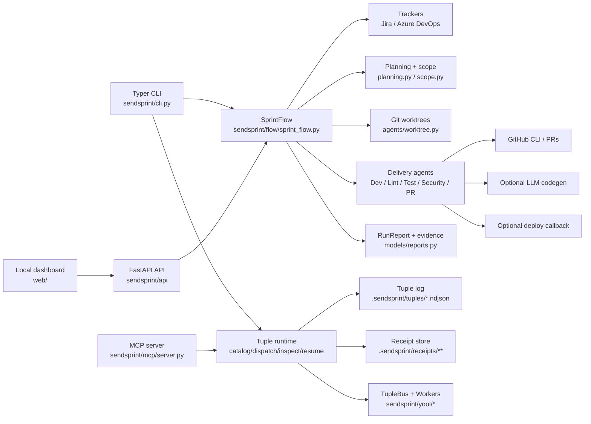

# SendSprint Architecture

SendSprint is a Python-first sprint delivery operator with a local API and a
React Native Web dashboard. Its core promise is to turn backlog items into a
validated, auditable delivery flow: read sprint work, map architecture, isolate
branches, run quality gates, capture evidence, create PRs, and report the run.

## Runtime Shape

## Main Modules

| Area | Files | Responsibility |
|---|---|---|
| CLI | `sendsprint/cli.py` | Typer commands, rendering, option parsing, command exit behavior |
| Orchestration | `sendsprint/flow/sprint_flow.py` | End-to-end delivery sequence, dry-run, resume, worktree, commit, push, PR, deploy |
| Tuple runtime | `sendsprint/yool/*`, `scripts/build_agent_catalog.py` | HAMT catalog, dispatch, tuple log, receipts, bus/workers, inspect/resume primitives |
| Domain models | `sendsprint/models/*.py` | Sprint, workspace, reports, PR info, evidence, security findings |
| Tracker operators | `sendsprint/operators/*.py` | Jira and Azure DevOps read paths with MCP/API/Playwright fallback |
| Planning | `sendsprint/planning.py`, `sendsprint/agents/story_task_planner.py` | Route sprint items to repos, branch names, confidence scoring |
| Repo readiness | `sendsprint/architecture/*`, `sendsprint/tech/detector.py`, `sendsprint/preflight.py` | Architecture score, stack detection, safe-run checks |
| Delivery agents | `sendsprint/agents/dev.py`, `lint_runner.py`, `test_runner.py`, `security_reviewer.py` | Install/build, lint, tests/E2E evidence, flag-only security |
| PR flow | `sendsprint/agents/pr_creator.py`, `pr_body_builder.py`, `pr_reviewer.py` | Push/PR creation and review report content |
| API/dashboard | `sendsprint/api/*`, `web/` | Local run API, SSE events, run screen and evidence thumbnails |
| Release tooling | `.github/workflows/*`, `scripts/*` | CI, release hygiene, PyPI publish, changelog and coverage badge automation |

## Delivery Flow

1. CLI/API resolves workspace, scope, operator, codegen, deploy, and run id.
2. Operator reads a sprint or iteration from Jira/Azure DevOps.
3. Scope filters items by user/status/key.
4. Planning routes deliverable items to repos and branches.
5. Dry-run returns a `DeliveryPlan`; normal run persists state in `.sendsprint/runs/`.
6. Each delivery item runs through architecture, dev/build, optional codegen, lint, tests, security, fix loop, commit, push, PR, review, and optional deploy.
7. A `RunReport` is emitted and can be serialized as JSON for CLI, API, PR bodies, dashboard, and future evidence bundles.
8. The yool runtime exposes `.catalog/agents.json`, append-only tuple logs, MCP `snapshot/dispatch/inspect`, and CLI `sprint catalog|dispatch|inspect|resume` for addressable capability execution.

## Safety Boundaries

- Security review is flag-only. High/critical findings fail the step and are not auto-fixed.
- LLM code generation is opt-in and budgeted by provider, model, token, and max USD.
- Deploy callbacks are opt-in and happen after PR creation.
- Worktree isolation is the intended execution boundary for multi-repo or multi-task runs.
- Dry-run must stay side-effect free.

## Validation Surface

- Python: `ruff`, `mypy`, `pytest`.
- Node/web: root `npm run lint`, root `npm test`, optional Playwright via `npm run test:e2e`.
- CI: `.github/workflows/ci.yml`, `sendsprint.yml`, `release-hygiene.yml`, `pypi-publish.yml`.
- Local orchestration: `taskflow inspect <repo>` before work and `taskflow run <repo>` before closing.

## Current Roadmap Anchor

The active sprint-autopilot roadmap is tracked in
`docs/roadmap/sprint-autopilot-roadmap.md` and GitHub issues `#27` through
`#40`. New implementation should extend existing orchestration surfaces instead
of creating a parallel product model.
