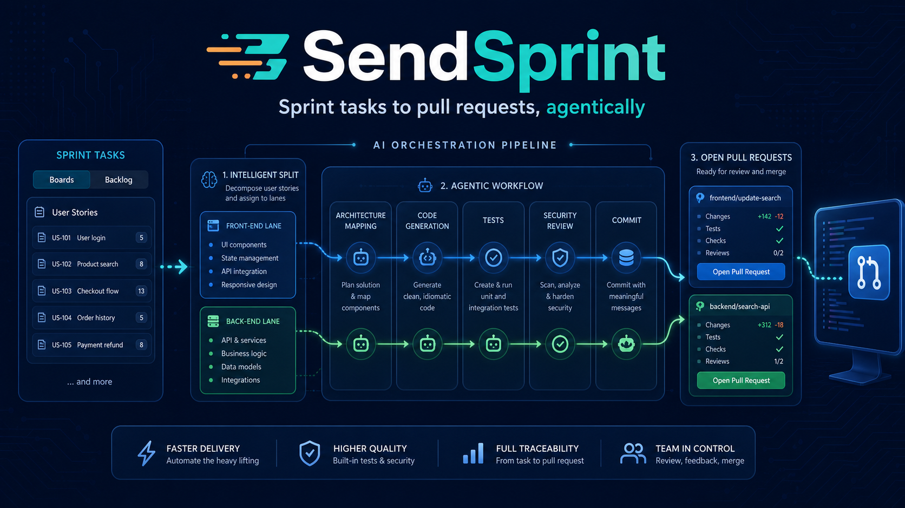
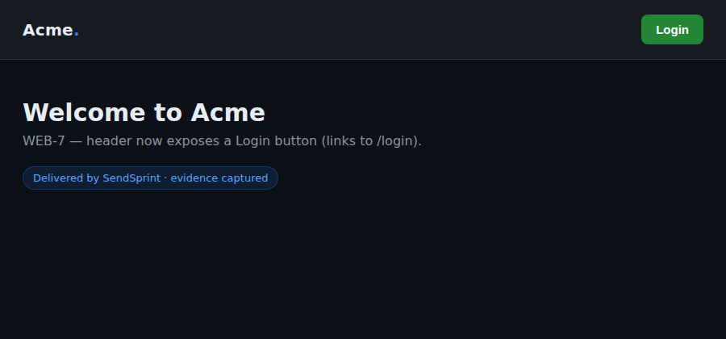

# SendSprint

<p align="center">
  
</p>

<p align="center">
  <a href="https://pypi.org/project/simplicio-sprint/"></a>
  <a href="https://pypi.org/project/simplicio-sprint/"></a>
  <a href="./LICENSE"></a>
</p>

> 🇺🇸 English. Leia em português: [README.pt-BR.md](README.pt-BR.md).

**SendSprint is an autonomous agent that finishes the cards assigned to you.**
It reads your sprint from **Jira**, **Azure DevOps** or **GitHub Issues**,
rewrites each card into the **[simplicio-mapper](https://github.com/wesleysimplicio/simplicio-mapper)**
spec format, hands the actual code edit to
**[simplicio-cli](https://github.com/wesleysimplicio/simplicio-cli)**, captures
test + screen evidence, commits on an isolated branch, and opens a **draft pull
request** with the evidence attached. Then it watches the PR and feeds your
review comments back to simplicio until you approve.

You don't sit at the keyboard invoking it. A scheduled trigger runs it; your
only job is to **review the draft PR**.

## Contents

- [The split that makes it work](#the-split-that-makes-it-work)
- [The full pipeline](#the-full-pipeline)
- [Demonstration: a frontend card, end to end](#demonstration-a-frontend-card-end-to-end)
- [Install](#install)
- [Configure credentials](#configure-credentials)
- [How to invoke it](#how-to-invoke-it)
- [Watch mode (the listener)](#watch-mode-the-listener)
- [The simplicio-mapper specs](#the-simplicio-mapper-specs)
- [The 600-subagent fan-out](#the-600-subagent-fan-out)
- [Keeping the tools current](#keeping-the-tools-current)
- [Install the skill into your IDE / agent](#install-the-skill-into-your-ide--agent)
- [Logging — capture every step](#logging--capture-every-step)
- [Architecture](#architecture)
- [Environment variables](#environment-variables)
- [Command reference](#command-reference)
- [FAQ](#faq)
- [Tests](#tests) · [License](#license)

## The split that makes it work

- **SendSprint = the agent (the brain).** It owns the flow start to finish:
  read → map → execute → evidence → commit → PR → update ticket → review loop.
- **simplicio-cli = the executor (the hands).** Stateless. It runs *one task →
  applied diff*. It knows nothing about sprints, branches or PRs.

This separation is the whole idea: the brain never writes code, and the hands
never make decisions. Each can be tested and swapped independently.

## The full pipeline

```
trigger (cron / GitHub Action / Claude web)   ← removes you from the loop
  └─ SendSprint (agent)
       0. update tools       latest simplicio-cli / -prompt / -mapper (per profile)
       1. read sprint        Jira / Azure DevOps / GitHub Issues   (mcp → api, --scope mine)
       2. map each card      → .specs/... plus project-map + precedent context
       2b. (optional) fan-out brainstorm via YOOL/TUPLE/HAMT lazy subagents
       3. simplicio task ... ← the only thing simplicio-cli does (one task → diff)
       3b. collect evidence  tests + Playwright screenshot
       4. commit + push      isolated git worktree, bounded backoff
       5. open DRAFT PR      ← your only review surface
       6. attach evidence    test results + screenshots + manifest
       7. update the ticket  "In Review" + PR link
       8. watch the PR       review comment? → simplicio revises → re-evidence
            ✓ you approve → merge → next card

   …and every step above is written to a log file (see Logging).
```

## Demonstration: a frontend card, end to end

A committed simulation proves the whole pipeline for a **frontend card**, without
needing live credentials or a browser in CI:
[`tests/test_e2e_frontend_sim.py`](./tests/test_e2e_frontend_sim.py).

```bash
pytest tests/test_e2e_frontend_sim.py -q
```

The card "**WEB-7 — Add a Login button to the homepage header**" arrives from
Jira **over MCP**, and the test walks every stage:

1. **Collect** the task from Jira (MCP transport) → a `Sprint` with the card.
2. **Map** it into `.specs/sprints/sprint-42/01-add-a-login-button…task.md`
   (acceptance criteria become `AC-1`, `AC-2`).
3. **Execute** — the simulated edit adds the button to `index.html`
   (`<a href="/login"><button>Login</button></a>`), exactly as simplicio applies a diff.
4. **Evidence** — run tests and capture a **screenshot** committed under
   `.sendsprint/evidence/WEB-7/screen.png`.
5. **PR** — open a **draft** pull request with the evidence embedded.

The captured "print" of the delivered screen:



…and the evidence comment SendSprint posts on the PR:

```markdown
## SendSprint evidence

### Steps
- [x] execute
- [x] evidence
- [x] commit

### Tests & screens
- ✅ **unit**: pytest — exit 0
- ✅ **screenshot**: homepage

  
```

> The committed test uses a tiny injected PNG so it runs anywhere; with Playwright
> installed (`pip install -e ".[screenshot]" && playwright install chromium`) the
> real flow captures a true screenshot of the running screen — that's how the image
> above was produced.

## Install

```bash
# 1) SendSprint itself (published on PyPI as `simplicio-sprint`)
pip install simplicio-sprint

# 2) the executor (required for real code edits)
pip install simplicio-cli

# 3) optional: Playwright screen evidence
pip install "simplicio-sprint[screenshot]" && playwright install chromium

# 4) optional but recommended: pull the latest of every external tool
#    (also installs the simplicio-prompt kernel used by --fanout)
sendsprint update
```

Working on the agent itself? Clone the repo and `pip install -e ".[dev]"` instead.

Requirements: **Python ≥ 3.11** and **git**. `sendsprint update` additionally
needs `git` on PATH to clone the simplicio-prompt / simplicio-mapper helpers.

## Configure credentials

Credentials are read from the OS keyring (via `sendsprint login`) or from
environment variables. You only need the source(s) you actually use.

```bash
# one-time keyring storage
sendsprint login jira           # prompts for email + API token
sendsprint login azuredevops    # prompts for organization + PAT
# GitHub uses the GITHUB_TOKEN environment variable — no keyring entry needed
```

Or via environment variables — see [Environment variables](#environment-variables).

## How to invoke it

There are two ways: **directly via the CLI**, or **by asking an AI agent**
(Claude Code, Codex, Cursor, …) that has the SendSprint skill installed.

### A) Directly, via the CLI

```bash
# Jira sprint 42
sendsprint run jira 42 --repo . --repo-slug owner/repo --scope mine

# Azure DevOps iteration (note the escaped backslash)
sendsprint run azuredevops "Team\\Sprint 12" --repo . --repo-slug repoId

# GitHub milestone #7 (or "*" for all open issues assigned to you)
sendsprint run github 7 --repo . --repo-slug owner/repo --scope mine
```

What the arguments mean:

| Argument | Meaning |
|---|---|
| `<source>` | `jira` \| `azuredevops` \| `github` |
| `<sprint>` | Jira sprint id, ADO iteration path, or GitHub milestone (`*` = all open) |
| `--repo` | path to the target git repository |
| `--repo-slug` | `owner/repo` (GitHub) or repository id (Azure DevOps) — used for the PR |
| `--scope mine` | deliver only the cards assigned to you (`all` for the whole sprint) |
| `--base` | the PR target branch (default `develop`) |
| `--fanout` | run the 600-subagent brainstorm per card (opt-in) |
| `--no-specs` | skip writing the simplicio-mapper `.specs/` file |
| `-o report.json` | write the full run report as JSON |

### B) By asking an AI agent

If the skill is installed (see
[Install the skill](#install-the-skill-into-your-ide--agent)), the host
assistant **never reimplements the flow — it shells out to the `sendsprint`
CLI**. These phrases trigger it:

- 🇧🇷 "rode o sendsprint", "executar sprint", "entregar sprint"
- 🇺🇸 "run sendsprint", "ship my sprint", "deliver my sprint"
- 🇪🇸 "ejecutar sprint"
- the slash command `/sendsprint`
- or simply naming a sprint id + source + repo together

When your MCP servers (Atlassian / Azure DevOps / GitHub) are available, the
agent registers them so the operators read live tenant state over MCP; otherwise
the operators fall back to the REST API automatically.

## Watch mode (the listener)

Watch mode is how SendSprint **runs without you at the keyboard**. It polls the
source, delivers the cards you haven't delivered yet, and remembers what it
already shipped so it never duplicates work.

```bash
# one pass and exit — this is what a cron / GitHub Action / scheduled trigger calls
sendsprint watch jira 42 --repo . --repo-slug owner/repo --once

# stay alive and run a pass every 15 minutes (Ctrl-C to stop)
sendsprint watch jira 42 --repo . --repo-slug owner/repo --interval 15

# at most N cards per cycle (default 1 — small, reviewable PRs)
sendsprint watch github "*" --repo . --repo-slug owner/repo --once --max-per-cycle 3
```

How it behaves:

- It always scopes to **your** cards (`--scope mine`).
- Delivered card keys are recorded in **`.sendsprint/runs/watch-state.json`**; the
  next pass skips them. Delete that file to re-deliver.
- `--once` does a single cycle and exits with a non-zero code if any step failed
  (ideal for CI). Without `--once` it loops forever, one cycle per `--interval`
  minutes, and **keeps running even if a cycle fails** (the error is logged).
- Each delivered card still stops at a **draft PR** — watch mode never merges.

### Schedule it

Run `sendsprint watch ... --once` from:

- a **GitHub Action** on a schedule — see
  [`.github/workflows/sendsprint.yml`](./.github/workflows/sendsprint.yml);
- a **cron job**;
- a **Claude Code on the web** scheduled trigger
  ([docs](https://code.claude.com/docs/en/claude-code-on-the-web)).

You can also keep an eye on the PR after it's open: an agent subscribed to PR
activity reacts to review comments by running the review loop (below).

## The simplicio-mapper specs

Before handing a card to simplicio-cli, SendSprint writes it into the
[simplicio-mapper](https://github.com/wesleysimplicio/simplicio-mapper) format
inside the worktree, so the executor has rich, structured context:

```
.specs/sprints/
├── BACKLOG.md
└── sprint-XX/
    ├── SPRINT.md
    └── NN-slug.task.md     # frontmatter + Acceptance Criteria, Test plan, Definition of Done
```

Each task file carries the card's title, description, acceptance criteria
(parsed into `AC-1`, `AC-2`, …), labels and ticket link. Turn it off with
`--no-specs`.

When the target repo already has mapper artifacts, SendSprint also reads
`.simplicio/project-map.json` and `.simplicio/precedent-index.json`. It ranks
relevant files, recent changes, architecture signals and precedent snippets for
the current card, embeds them under `## Structured mapper context`, and passes
that same compact context to simplicio-cli.

## The 600-subagent fan-out

Optionally, before implementing a card, SendSprint can fan the task out across
**hundreds of real subagents** via
[simplicio-prompt](https://github.com/wesleysimplicio/simplicio-prompt) to
brainstorm edge cases and a plan, then folds the result into the simplicio task.
When `SIMPLICIO_PROMPT_REPO` points at a current simplicio-prompt checkout,
SendSprint uses the YOOL/TUPLE/HAMT `PromptFanout` adapter and lazy
`batch_spawn` receipts instead of enumerating workers. The older
`SIMPLICIO_PROMPT_KERNEL` subprocess path remains as a fallback.

```bash
# 600 subagents per card (needs the kernel + a provider key)
sendsprint run jira 42 --repo . --repo-slug owner/repo --fanout

# offline cost preview — no API key, no network
sendsprint run jira 42 --repo . --repo-slug owner/repo --fanout --fanout-dry-run
```

It is **opt-in** and **degrades gracefully**: with no tuple adapter, kernel or
key it logs a `skipped` step and continues. `sendsprint update` installs the
prompt checkout and points `SIMPLICIO_PROMPT_KERNEL` at the legacy kernel
automatically.

## Keeping the tools current

`sendsprint update` pulls the latest of every moving part:

```bash
sendsprint update                 # all three
sendsprint update --no-mapper     # skip simplicio-mapper
```

| Tool | How it updates |
|---|---|
| simplicio-cli | `pip install -U simplicio-cli` |
| simplicio-prompt | git clone/pull into the cache, sets `SIMPLICIO_PROMPT_KERNEL` |
| simplicio-mapper | git clone/pull into the cache |

`run` and `watch` also refresh tools at start, driven by your runtime profile
(`~/.config/sendsprint/profile.yaml`). Skip it per-run with `--no-update`, or
globally with `SENDSPRINT_NO_UPDATE=1`.

## Install the skill into your IDE / agent

`sendsprint install` writes the SendSprint skill into each agent's own
convention, from a single source, so the trigger phrases work everywhere.

```bash
sendsprint install --all                 # every supported agent
sendsprint install -t cursor -t claude    # just these
sendsprint install --all --repo /path/to/project
```

| Agent | Where the skill is written |
|---|---|
| Claude Code | `.claude/skills/sendsprint/SKILL.md` |
| Cursor | `.cursor/rules/sendsprint.mdc` |
| Kiro | `.kiro/steering/sendsprint.md` |
| Gemini | `GEMINI.md` (managed block) |
| Codex / OpenCode / Antigravity | `AGENTS.md` (managed block) |
| Hermes / openclaw | `AGENTS.md` (managed block — fallback) |

Shared files (`AGENTS.md`, `GEMINI.md`) get an **idempotent managed block**
between markers, so re-running never clobbers your existing content.

## Logging — capture every step

Every command configures the `sendsprint` logger to a **rotating log file** (full
DEBUG detail) plus the console. The log records each delivery step, every
simplicio / fan-out invocation, transport choices and errors.

```bash
# global options (before the subcommand)
sendsprint --log-level DEBUG run jira 42 --repo . --repo-slug owner/repo
sendsprint --log-json --log-file ./run.jsonl run github "*" --repo .
```

- Default location: `~/.local/state/sendsprint/logs/sendsprint.log` (override with
  `SENDSPRINT_LOG_DIR`).
- `--log-json` writes one JSON object per line (easy to ingest).
- `run` also archives the full `RunReport` JSON next to the logs
  (`run-<timestamp>.report.json`).

## Architecture

```
sendsprint/
├── operators/      task readers: JiraOperator, AzureDevopsOperator, GitHubIssuesOperator (mcp|api)
│   └── _mcp_bridge.py  host-injected MCP seam (register_provider → fetch)
├── executor/       SimplicioExecutor — the boundary to simplicio-cli (task → applied diff)
├── mapper/         MapperAdapter — .specs/ tasks + project-map/precedent context
├── prompt/         PromptFanout — simplicio-prompt YOOL/TUPLE/HAMT fan-out
├── delivery/       worktree, git_ops, evidence manifest, PR create/review
├── models/         Sprint, SprintItem, StepReport, RunReport, ScopeConfig (Pydantic v2)
├── github_integration.py  ReviewReader (PR feedback) + evidence comment posting + CI
├── scope.py        --scope mine filtering
├── bootstrap.py    sendsprint update (pull latest tools) + start-up checks
├── installer.py    sendsprint install (write the skill per agent)
├── logging_setup.py  central logging (file + console, JSON optional)
├── flow.py         the orchestrator (read → map → simplicio → evidence → PR → review loop)
├── watch.py        the unattended trigger
└── cli.py          Typer CLI: run, watch, update, install, login, logout, version
```

## Environment variables

| Variable | For |
|---|---|
| `JIRA_BASE_URL`, `JIRA_EMAIL`, `JIRA_API_TOKEN` | Jira |
| `AZURE_DEVOPS_ORG`, `AZURE_DEVOPS_PROJECT`, `AZURE_DEVOPS_PAT` | Azure DevOps |
| `GITHUB_TOKEN`, `GITHUB_REPO` | GitHub Issues + PRs |
| `SIMPLICIO_MODEL`, `SIMPLICIO_BASE_URL`, `SIMPLICIO_TEST_CMD` | simplicio-cli |
| `SIMPLICIO_PROMPT_REPO` | path to a simplicio-prompt checkout with `examples/python/prompt_fanout.py` |
| `SIMPLICIO_PROMPT_KERNEL` | path to the fan-out kernel (auto-set by `sendsprint update`) |
| `SENDSPRINT_CACHE_DIR` | where git-cloned tools live (default `~/.cache/sendsprint`) |
| `SENDSPRINT_LOG_DIR` | where logs live (default `~/.local/state/sendsprint/logs`) |
| `SENDSPRINT_NO_UPDATE` | set to `1` to skip the start-up tool update |
| `SENDSPRINT_CONFIG_DIR` | profile location (default `~/.config/sendsprint`) |

## Command reference

| Command | What it does |
|---|---|
| `sendsprint run <source> <sprint>` | deliver a sprint: each card → simplicio → evidence → draft PR |
| `sendsprint watch <source> <sprint>` | unattended trigger; `--once` for cron/CI, else loops |
| `sendsprint update` | pull latest simplicio-cli / -prompt / -mapper |
| `sendsprint install --all` | write the skill into every supported agent |
| `sendsprint login <provider>` | store credentials in the OS keyring |
| `sendsprint logout <provider> <account>` | remove a stored credential |
| `sendsprint version` | print the version |

Global options (before the subcommand): `--log-level`, `--log-file`, `--log-json`.

## FAQ

**Do I need simplicio-cli installed?**
For real code edits, yes (`pip install simplicio-cli`). Without it, the execute
step is reported as `skipped` and no diff is produced — the rest of the flow
still runs so you can see the wiring.

**What if I have no Jira/ADO/GitHub MCP server?**
No problem. Transport is `auto`: it tries MCP first (when the host registers a
provider) and falls back to the REST API. Set the REST credentials and you're
fine.

**Does it ever merge or push to my main branch?**
No. It pushes the work to an **isolated branch** and opens a **draft PR**. You
review and merge. Watch mode is the same — it always stops at the draft PR.

**Will it touch files outside the task?**
The executor is constrained to "touch only what the task requires; keep tests
green". The mapper only ever writes under `.specs/`. The skill installer only
writes its dedicated files or a marked block in `AGENTS.md`/`GEMINI.md`.

**Is the 600-subagent fan-out required?**
No — it's opt-in (`--fanout`) and skips gracefully without a kernel/key. Use
`--fanout-dry-run` to preview cost offline.

**A reviewer left a comment — what happens?**
The review loop deduplicates actionable feedback, includes file/line context,
re-runs simplicio to address it, re-collects fresh evidence, writes an evidence
manifest, and pushes — repeating until you approve. An agent subscribed to PR
activity can drive this automatically.

**Where do I see what happened?**
In the log file (`~/.local/state/sendsprint/logs/sendsprint.log`) and the
archived `RunReport` JSON. Use `--log-level DEBUG` for full detail.

**How do I re-deliver a card watch already shipped?**
Delete its key from (or remove) `.sendsprint/runs/watch-state.json`.

## Tests

```bash
pip install -e ".[dev]"
pytest tests/ -q
ruff check sendsprint/ && ruff format sendsprint/
```

## License

MIT — see [LICENSE](./LICENSE).
