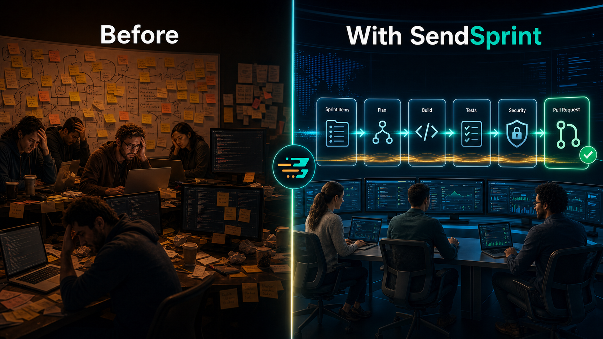
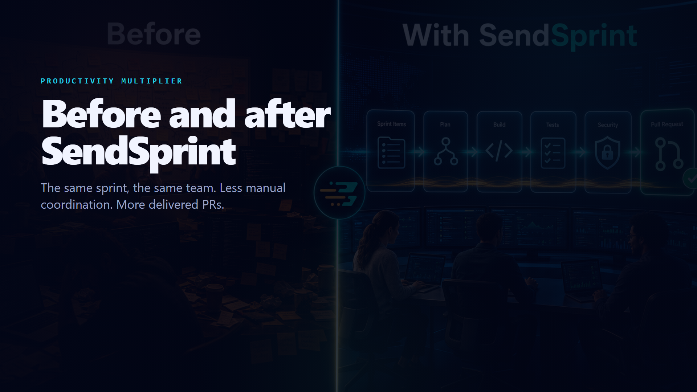

# SendSprint


<p align="center">
  
</p>

> 🇺🇸 English. Leia em português: [README.pt-BR.md](README.pt-BR.md).


SendSprint is a **personal autonomous sprint-to-pull-request delivery utility** — a public open-source package you install into your own machine and authorize against the repos you already work on. It reads Jira or Azure DevOps sprint work, maps the target architecture, creates isolated branches/worktrees, builds, tests, checks security, captures evidence, commits, opens pull requests, reviews the diff, and reports delivery state in one controlled flow with opt-in LLM code generation and deploy callbacks.

**There is no hosted service, no SaaS tenant, no billing, no subscription.** Everything runs locally under your control: credentials live in your OS keyring, work happens in worktrees on your disk, and any action against a company project is gated by the operator who launched the run. The repo stays public on GitHub so others can install it the same way — but the workflow is yours, not someone else's product.

The proposal is simple: remove the manual coordination tax between backlog, code, tests, evidence, and PRs. SendSprint gives a single engineer a repeatable execution lane from sprint planning to `develop`, with preflight validation, dry-run planning, resumable runs, branch-per-task delivery, and auditable output.

## Productivity Visuals

### Without vs. with SendSprint



### SendSprint as the delivery engine


## 🎬 Videos

### Productivity before/after (47s)



<p align="center">
  <a href="./video/preview/sendsprint-before-after-en.mp4">▶️ English MP4 (1920×1080, 47s, 7.1 MB)</a>
  &nbsp;·&nbsp;
  <a href="./video/preview/sendsprint-before-after-pt.mp4">🇧🇷 Portuguese MP4 (1920×1080, 47s, 7.1 MB)</a>
</p>

### Product explainer (56s)


<p align="center">
  <a href="./video/preview/sendsprint-explainer-en.mp4">▶️ Full MP4 (1920×1080, 56s, 20 MB)</a>
  &nbsp;·&nbsp;
  <a href="./video/preview/poster.png">🖼️ Poster</a>
</p>

### Run loop demo (22s) — what `web/RunScreen` shows


<p align="center">
  <a href="./video/preview/runloop-en.mp4">▶️ Full MP4 (1920×1080, 22s, 5.5 MB)</a>
  &nbsp;·&nbsp;
  <a href="./video/">🛠️ Source (Remotion)</a>
</p>

> 🇧🇷 Versão em português dos vídeos: ver [README.pt-BR.md](README.pt-BR.md).

## Presentations

Stakeholder-ready implementation decks are available in editable and PDF formats:

- [English PPTX](./docs/presentations/sendsprint-implementation-en.pptx) · [English PDF](./docs/presentations/sendsprint-implementation-en.pdf)
- [Portuguese PPTX](./docs/presentations/sendsprint-implementation-pt-BR.pptx) · [Portuguese PDF](./docs/presentations/sendsprint-implementation-pt-BR.pdf)
- [Slide preview sheets](./docs/presentations/README.md)

The MP4 videos are generated locally by Remotion and include a generated music bed plus workflow sound effects (`cd video && npm run build:preview`).
The run-loop one shows exactly what happens in the browser when you open
`http://localhost:8081` and start a sprint delivery: round 1 fails with a
visual regression, fix-loop applies patches, round 2 turns green, PR opens.

## 🌐 Run it in your browser (web)

```bash
# one command: ensure API + web UI and open the browser
pip install -e ".[api]"
cd web && npm install
sendsprint web                    # UI http://localhost:8081, API http://127.0.0.1:8765
```

See [`web/README.md`](./web/README.md) for the full walkthrough and
[`sendsprint/api/README.md`](./sendsprint/api/README.md) for the HTTP/SSE API.
The first `sendsprint run`, `sendsprint watch`, or `sendsprint sprint` of the
day now tries to ensure the localhost dashboard is up and opens
`http://localhost:8081` automatically. Use `--no-dashboard` to skip it.
`--full-mode` is a shortcut for maximum autonomy (`deploy-callback`), and
`sendsprint full --workspace ...` starts the continuous watch loop in that mode.
`sendsprint configure-defaults` persists repo/workspace defaults plus startup
checks for package dependencies, `llm-project-mapper` refresh, dashboard
bootstrap, and Python fallback when the web UI is blocked.


Works across **13 AI coding tools**: Claude Code, Codex CLI, GitHub Copilot, Cursor, Windsurf, Kiro, Zed, Cline, Continue, Aider, Sourcegraph Cody, Hermes, Openclaw.

> **Status:** v0.17.0 — OSS contribution mode adds snapshot, dedupe, candidate, validation, publish, monitor, rework, and learning records for public project cooperation. `sendsprint watch` can poll Jira/Azure DevOps for eligible assigned tasks, deduplicate by item revision/state, respect autonomy policy, run in conservative planning mode by default, and persist local watch-state/evidence. `sendsprint doctor`, stack validation templates, dry-run plans, deterministic task worktrees, evidence bundles, GitHub Issues tracker helpers, Ralph Wiggum / Codex Goal loop contracts, transcript-to-task ingestion, dashboard snapshots, executive reports, and PyPI Trusted Publishing workflow support are built in. Core delivery still includes chat-triggered `sendsprint sprint`, Jira/Azure DevOps reads, opt-in LLM code generation/deploy callbacks, resumable run state, PR creation, post-PR validation, coverage badge automation, and changelog promotion.

---

## Flow

| Step | Name | What it does |
|------|------|-------------|
| 1 | **Read sprint** | Fetch stories/tasks/bugs from Jira or Azure DevOps |
| 2 | **Architecture mapping** | Inspect repo docs; auto-generate baseline if score < 0.6 |
| 3 | **Dev** | Detect tech stack, create worktree, install deps + build |
| 4 | **Lint** | Static analysis per tech (eslint, ruff, clippy, etc.) |
| 5 | **Tests** | Unit tests + Playwright E2E with screenshot evidence |
| 6 | **Security review** | Flag-only scan (secrets, env files, npm audit) |
| 7 | **Fix loop** | If lint/tests/security fail: re-build + re-run (max 3 rounds) |
| 8 | **Commit** | `git add -A && git commit` on worktree branch |
| 9 | **Create PR** | GitHub (gh CLI) or Azure DevOps REST API |
| 10 | **PR review + Delivered** | Diff analysis + RunReport with JSON export |

Optional hooks:

- **Step 3.5 — LLM code generation** applies an opt-in unified diff between build and lint.
- **Step 11 — Deploy trigger** posts an opt-in webhook after PR creation and attempts a ticket status update.

Transport priority: `mcp` -> `api` -> `playwright`.

---

## Requirements

- Python `>=3.11`
- Playwright (`playwright install chromium`)
- Optional: Jira API token / Azure DevOps PAT, or Atlassian / Azure DevOps MCP server

---

## Install

```bash
git clone https://github.com/wesleysimplicio/SendSprint.git
cd SendSprint
pip install -e .
playwright install chromium
cp .env.example .env  # fill in credentials
```

---

## Quick start

### CLI

```bash
# Full 10-step flow against a Jira sprint
sendsprint run jira 42 --workspace workspace.yaml --scope mine -o report.json

# Same flow with opt-in LLM patch generation and deploy callback
sendsprint run jira 42 --workspace workspace.yaml --scope mine --llm-codegen --deploy

# Full flow against Azure DevOps
sendsprint run azuredevops "Team\\Sprint 12" --repo ./repo

# Validate environment/sprint safety before delivery
sendsprint preflight azuredevops "Team\\Sprint 12" --workspace workspace.yaml

# Plan branches/repos/PR targets without writing files or opening PRs
sendsprint run azuredevops "Team\\Sprint 12" --workspace workspace.yaml --dry-run

# Resume a previous run idempotently
sendsprint run azuredevops "Team\\Sprint 12" --workspace workspace.yaml --run-id sprint-12

# Inspect tuple DAG + receipt cost rollup
sendsprint sprint inspect tuple-20260519T120000-abcd1234 --cost

# Emit one yool directly through the shared CLI/MCP dispatch path
sendsprint sprint dispatch agent.codex.plan --payload '{"story":"APP-1"}'

# Browse the spec-shaped HAMT catalog
sendsprint sprint catalog list
sendsprint sprint catalog find "/codex/"
sendsprint sprint catalog show agent.codex.plan

# Watch assigned tasks periodically in conservative planning mode
sendsprint watch --workspace workspace.yaml --autonomy plan

# Continuous full mode with maximum autonomy and dashboard bootstrap
sendsprint full --workspace workspace.yaml

# Persist your local operational defaults
sendsprint configure-defaults --repo . --workspace workspace.yaml

# Watch once without changing repos or watch-state
sendsprint watch --workspace workspace.yaml --dry-run

# Detect tech stack
sendsprint detect-tech ./repo

# Check architecture mapping (with auto-build if missing)
sendsprint check-architecture ./repo --build

# Sync latest agentic-starter scaffold files into a repo
sendsprint sync-agentic-starter ./repo --ref latest
```

### Python

```python
from sendsprint.flow import SprintFlow
from sendsprint.operators import JiraOperator
from sendsprint.workspace import load_workspace
from sendsprint.scope import build_scope

ws = load_workspace("workspace.yaml")
scope = build_scope(mode="mine", user_email="dev@example.com")
flow = SprintFlow(operator=JiraOperator(), workspace=ws, scope=scope)
result = flow.run(sprint_id=42)
print(result.run_report.summary)
```

### Read a sprint only

```python
from sendsprint.operators import JiraOperator

op = JiraOperator(
    base_url="https://your-org.atlassian.net",
    transport="auto",
)
sprint = op.read_sprint(sprint_id=42)
for item in sprint.items:
    print(f"  [{item.type}] {item.key} - {item.title} ({item.status})")
```

### Tuple runtime surfaces

SendSprint now boots `sprint run` through the yool/tuple runtime. The main
delivery path seeds worker-root tuples and executes the legacy delivery agents
as lane subscribers (`dev -> lint -> test -> security -> pr`) with shared
receipts for cross-run cache and resume.

- `.catalog/agents.json` — spec-shaped HAMT catalog generated by `python scripts/build_agent_catalog.py`
- `sendsprint sprint catalog ...` — list/find/show yools
- `sendsprint sprint dispatch ...` — append one tuple into `.sendsprint/tuples/<run_id>.ndjson`
- `sendsprint sprint inspect <run_id> --cost` — inspect tuple DAG + receipt rollup
- `sendsprint sprint resume <run_id|tuple_id>` — replay pending tuples from the append-only log
- `sendsprint run ... --no-cache` / `sendsprint sprint ... --no-cache` — bypass receipt reuse for a fresh execution pass
- MCP: `sendsprint_snapshot`, `sendsprint_dispatch`, `sendsprint_inspect`

---

## Multi-repo workspace

Define repos in `workspace.yaml`:

```yaml
name: my-project
root_path: /home/dev/repos
new_projects_dir: Projetos/novos
pr_provider: github
default_base_branch: develop
branch_name_template: feature/{number}-{title}
pr_reviewers:
  - reviewer@example.com
required_pr_reviewers:
  - lead@example.com
code_generation:
  enabled: false
  provider: anthropic
  model: claude-opus-4-7
  max_usd: 1.0
  max_tokens: 8000
deploy:
  enabled: false
  provider: webhook
  url: https://deploy.example.com/hooks/sendsprint
  final_status: Deployed
watch:
  enabled: true
  provider: azuredevops
  interval_minutes: 15
  scope: assigned_to_me
  allowed_states:
    - New
  ignored_states:
    - Removed
    - Closed
    - Done
  work_item_types:
    - Task
  iteration_path: Team\\Sprint 12
  max_tasks_per_cycle: 1
  require_clean_worktree: true
  evidence_required: true
  playwright_required_for_front: true
  create_pr: true
  pr_target_branch: develop
repos:
  - name: backend-api
    path: backend-api
    role: api
    tech: dotnet
    default_branch: main
    pr_target_branch: develop
    # Optional per-repo reviewer rules:
    # required_pr_reviewers:
    #   - daniel.ribeiro_ext@interplayers.com.br
    # Optional per-repo override:
    # branch_name_template: hotfix/{number}-{title}
  - name: frontend-web
    path: frontend-web
    role: front
    tech: angular
  - name: mobile-app
    path: mobile-app
    role: mobile
    tech: flutter
```

Azure DevOps MCP can be configured for Codex with:

```bash
sendsprint install-ado-mcp --organization my-org --project "Projetos Ágeis" --team "Squad Yankee"
```

SendSprint can also expose its own deterministic tooling as an MCP stdio
server:

```bash
sendsprint mcp-serve
```

Current default MCP tools:

- `sendsprint_detect_tech`
- `sendsprint_check_architecture`
- `sendsprint_version`

The transport uses JSON-RPC 2.0 with `Content-Length` framing so Claude Code
and similar hosts can launch it directly.

When a User Story has no child tasks, SendSprint creates in-memory front/back
tasks before delivery. Generated tasks keep `parent_key` pointing to the story
and labels `scope:front` / `scope:back`, so each task runs only against matching
workspace repos.

---

## Architecture

```
sendsprint/
├── operators/         JiraOperator, AzureDevopsOperator (mcp|api|playwright)
├── models/            Sprint, SprintItem, StepReport, RunReport (Pydantic v2)
├── agents/
│   ├── worktree.py    Git worktree isolation for parallel branches
│   ├── dev.py         Install + build per tech stack (16 package managers)
│   ├── lint_runner.py Static analysis per tech (19 linters)
│   ├── test_runner.py Unit + E2E with screenshot evidence
│   ├── security_reviewer.py  Secret scan, env audit, npm audit
│   ├── pr_creator.py  GitHub (gh) / Azure DevOps (REST) PR creation
│   └── pr_reviewer.py Diff static checks (TODO, debug, long lines)
├── architecture/
│   ├── mapper.py      Weighted architecture scoring
│   └── builder.py     Auto-generate baseline docs
├── tech/
│   └── detector.py    Filesystem marker detection (25+ techs)
├── workspace/
│   └── loader.py      YAML/JSON multi-repo workspace config
├── scope.py           --scope mine filtering (account_id, email, name)
├── flow/
│   └── sprint_flow.py orchestrator + opt-in codegen/deploy hooks
├── llm/               Provider-agnostic LLM client
└── cli.py             Typer CLI
```

---

## Environment variables

| Variable | Required for |
|----------|-------------|
| `JIRA_BASE_URL` | Jira API |
| `JIRA_EMAIL` | Jira API |
| `JIRA_API_TOKEN` | Jira API |
| `AZURE_DEVOPS_ORG` | Azure DevOps API |
| `AZURE_DEVOPS_PROJECT` | Azure DevOps API |
| `AZURE_DEVOPS_PAT` | Azure DevOps API |
| `PLAYWRIGHT_CDP_URL` | Playwright fallback (default `http://127.0.0.1:9222`) |
| `LLM_PROVIDER` | LLM step (optional) |
| `LLM_MODEL` | LLM step (optional) |

---

## Assistant Integrations

Per-platform reference manifests live under `skills/`. SendSprint can also
install repo-local plugin adapters for the main assistant hosts:

```bash
sendsprint plugins list
sendsprint plugins install --repo . --all
```

| File | Platform |
|------|---------|
| `skills/claude/SKILL.md` | Claude Code |
| `skills/codex/AGENTS.md` | Codex / OpenAI |
| `skills/hermes/hermes.md` | Hermes Agent |
| `skills/openclaw/openclaw.md` | Openclaw |
| `skills/copilot/copilot-instructions.md` | GitHub Copilot |

Generated adapters target `.claude/skills/sendsprint/SKILL.md`,
`.codex/skills/sendsprint/SKILL.md`, `.hermes/skills/sendsprint.md`,
`.openclaw/skills/sendsprint.md`, `.cursor/rules/sendsprint.mdc`, and
`.github/copilot-instructions.md`. Each adapter references the same Python
core; the host assistant delegates to `sendsprint doctor`, `sendsprint web`,
`sendsprint sprint`, `sendsprint watch`, and `sendsprint full` instead of
reimplementing the pipeline. See `docs/PLUGIN_ADAPTERS.md`.

---

## Tests

```bash
pip install -e ".[dev]"
pytest tests/ -v
```

The suite covers operators, architecture mapper/builder, tech detector, scope filtering, workspace loading, CLI overrides, and all delivery agents including codegen/deploy orchestration.

---

## Roadmap

- [x] Step 1 - Sprint reading (Jira + Azure DevOps, MCP / API / Playwright)
- [x] Step 2 - Architecture mapping + auto-build baseline docs
- [x] Step 3 - Dev agent (tech detection, worktree isolation, install + build)
- [x] Step 4 - Test runner (unit + Playwright E2E with screenshot evidence)
- [x] Step 5 - Security reviewer (flag-only: secrets, env, npm audit)
- [x] Step 6 - Fix loop (re-build + re-test, max 3 rounds)
- [x] Step 7 - PR creation (GitHub gh CLI + Azure DevOps REST)
- [x] Step 8 - PR review (diff static checks)
- [x] Step 9 - RunReport with full evidence
- [x] Multi-repo workspace support (workspace.yaml)
- [x] `--scope mine` current-user filtering
- [x] LLM-powered code generation per sprint item
- [x] Deploy trigger + status callback to ticket
- [x] MCP server mode (expose SendSprint as an MCP tool)

---

## Personal use and operator authorization

SendSprint is a personal utility. Practical implications:

- **No hosted service exists.** There is no SaaS dashboard, no managed tenant, no
  billing portal. Everything runs from your terminal against `localhost`.
- **You are the operator.** Every Jira/ADO read, every git operation, every PR
  is initiated by a human launching `sendsprint sprint` (or starting the local
  API). The tool never acts on its own schedule.
- **Company repos are run under your authority.** When you point SendSprint at a
  company repo, you are using your existing access — same credentials and same
  branches you'd use by hand. No new permission boundary is introduced.
- **Public utility.** This repo is MIT-licensed on GitHub. Other engineers can
  install it the same way (`pip install -e .`) and run it on their own machines
  against their own work. There is no commercial offering planned.

If you ever want a hosted/multi-tenant version, fork the repo and build it
yourself — the architecture is intentionally local-first.

## License

MIT - see [LICENSE](./LICENSE).
