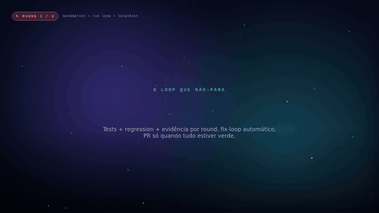

# SendSprint

> 🇧🇷 Versão em português. Read this in English: [README.md](README.md).

SendSprint e uma plataforma de entrega sprint-para-PR para times de engenharia. Ele le itens da sprint no Jira ou Azure DevOps, mapeia a arquitetura alvo, cria branches/worktrees isolados, builda, testa, valida seguranca, captura evidencias, comita, abre pull requests, revisa o diff e reporta o estado da entrega em um fluxo controlado de 10 passos.

A proposta e simples: remover o custo de coordenacao manual entre backlog, codigo, testes, evidencia e PR. O SendSprint cria uma esteira repetivel da sprint ate `develop`, com preflight, dry-run, execucao resumivel, branch por task e saida auditavel.

## Visuais de produtividade

### Time sem vs. com SendSprint


### SendSprint como motor de entrega


## 🎬 Vídeos

### Produtividade antes/depois (47s)


<p align="center">
  <a href="./video/preview/sendsprint-before-after-pt.mp4">▶️ MP4 em português (1920×1080, 47s, 7.1 MB)</a>
  &nbsp;·&nbsp;
  <a href="./video/preview/sendsprint-before-after-en.mp4">🇺🇸 MP4 em inglês (1920×1080, 47s, 7.1 MB)</a>
</p>

### Explicacao do produto (56s)


<p align="center">
  <a href="./video/preview/sendsprint-explainer.mp4">▶️ MP4 completo (1920×1080, 56s, 20 MB)</a>
  &nbsp;·&nbsp;
  <a href="./video/preview/poster.png">🖼️ Poster</a>
</p>

### Demo do run loop (22s) — o que o `web/RunScreen` mostra



<p align="center">
  <a href="./video/preview/runloop.mp4">▶️ MP4 completo (1920×1080, 22s, 5.5 MB)</a>
  &nbsp;·&nbsp;
  <a href="./video/">🛠️ Código-fonte (Remotion)</a>
</p>

> 🇺🇸 English versions of these videos: see [README.md](README.md).

## Apresentacoes

Decks executivos da implementacao estao disponiveis em formato editavel e PDF:

- [PPTX em ingles](./docs/presentations/sendsprint-implementation-en.pptx) · [PDF em ingles](./docs/presentations/sendsprint-implementation-en.pdf)
- [PPTX em portugues](./docs/presentations/sendsprint-implementation-pt-BR.pptx) · [PDF em portugues](./docs/presentations/sendsprint-implementation-pt-BR.pdf)
- [Previews dos slides](./docs/presentations/README.md)

Os MP4s são gerados localmente pelo Remotion com trilha musical e efeitos sonoros de workflow (`cd video && npm run build:preview`).
O do run loop mostra exatamente o que acontece no navegador quando você abre
`http://localhost:8081` e clica "Iniciar entrega": round 1 falha com regressão
visual, fix-loop aplica patches, round 2 fica verde, PR abre.

## 🌐 Rodar no navegador (web)

```bash
# 1) backend
pip install -e ".[api]"
python -m sendsprint.api          # http://localhost:8765

# 2) web UI (outro terminal)
cd web && npm install && npm run dev   # http://localhost:8081
```

Veja [`web/README.md`](./web/README.md) pro passo-a-passo e
[`sendsprint/api/README.md`](./sendsprint/api/README.md) pra API HTTP/SSE.


Funciona em **13 ferramentas de IA pra código**: Claude Code, Codex CLI, GitHub Copilot, Cursor, Windsurf, Kiro, Zed, Cline, Continue, Aider, Sourcegraph Cody, Hermes, Openclaw.

> **Status:** v0.11.0 — UX one-command via chat (`sendsprint sprint`). 13 manifestos de IDE. Cache de credencial em OS-keyring. Instalador MCP do Azure DevOps. Auto-scaffold `.specs/` com sync do `agentic-starter` mais recente. Fluxo completo de 10 passos. Preflight, dry-run, estado resumível, roteamento com confiança, reviewers obrigatórios e validação pós-PR inclusos. Visuais de produto, vídeos Remotion antes/depois com trilha e efeitos sonoros, e decks bilíngues da implementação estão inclusos. Branches usam `feature/{number}-{title}` e PRs miram `develop` por padrão; ambos podem ser configurados por workspace/repo. Checagens de hierarquia do backlog Azure evitam links pai Issue -> Task inválidos. Guia core de Jira/Azure DevOps incluso para regras estáveis de entrega. Publicação PyPI automatizada em tags de release.

---

## Fluxo de 10 passos

| Passo | Nome | O que faz |
|------|------|-------------|
| 1 | **Ler sprint** | Busca stories/tasks/bugs no Jira ou Azure DevOps |
| 2 | **Mapeamento de arquitetura** | Inspeciona docs do repo; gera baseline se score < 0.6 |
| 3 | **Dev** | Detecta tech stack, cria worktree, instala deps + build |
| 4 | **Lint** | Análise estática por tech (eslint, ruff, clippy, etc.) |
| 5 | **Testes** | Unit + Playwright E2E com evidência em screenshot |
| 6 | **Security review** | Scan flag-only (segredos, .env, npm audit) |
| 7 | **Fix loop** | Se lint/teste/sec falhar: re-build + re-run (até 3 rodadas) |
| 8 | **Commit** | `git add -A && git commit` no branch do worktree |
| 9 | **Criar PR** | GitHub (gh CLI) ou Azure DevOps via REST |
| 10 | **Review do PR + Entregue** | Análise de diff + RunReport com export JSON |

Prioridade de transporte: `mcp` -> `api` -> `playwright`.

---

## Requisitos

- Python `>=3.11`
- Playwright (`playwright install chromium`)
- Opcional: token Jira / PAT Azure DevOps, ou MCP server Atlassian / Azure DevOps

---

## Instalação

```bash
git clone https://github.com/wesleysimplicio/SendSprint.git
cd SendSprint
pip install -e .
playwright install chromium
cp .env.example .env  # preencha credenciais
```

---

## Quick start

### CLI

```bash
# Fluxo completo de 10 passos contra sprint Jira
sendsprint run jira 42 --workspace workspace.yaml --scope mine -o report.json

# Fluxo completo contra Azure DevOps
sendsprint run azuredevops "Team\\Sprint 12" --repo ./repo

# Validar ambiente/sprint antes de entregar
sendsprint preflight azuredevops "Team\\Sprint 12" --workspace workspace.yaml

# Planejar branches/repos/PRs sem gravar arquivos nem abrir PR
sendsprint run azuredevops "Team\\Sprint 12" --workspace workspace.yaml --dry-run

# Retomar uma execucao de forma idempotente
sendsprint run azuredevops "Team\\Sprint 12" --workspace workspace.yaml --run-id sprint-12

# Detectar tech stack
sendsprint detect-tech ./repo

# Conferir mapeamento de arquitetura (com auto-build se faltar)
sendsprint check-architecture ./repo --build

# Sincronizar os arquivos mais recentes do agentic-starter
sendsprint sync-agentic-starter ./repo --ref latest
```

### Python

```python
from sendsprint.flow import SprintFlow
from sendsprint.operators import JiraOperator
from sendsprint.workspace import load_workspace
from sendsprint.scope import build_scope

ws = load_workspace("workspace.yaml")
scope = build_scope(mode="mine", user_email="dev@example.com")
flow = SprintFlow(operator=JiraOperator(), workspace=ws, scope=scope)
result = flow.run(sprint_id=42)
print(result.run_report.summary)
```

### Apenas ler sprint

```python
from sendsprint.operators import JiraOperator

op = JiraOperator(
    base_url="https://your-org.atlassian.net",
    transport="auto",
)
sprint = op.read_sprint(sprint_id=42)
for item in sprint.items:
    print(f"  [{item.type}] {item.key} - {item.title} ({item.status})")
```

---

## Workspace multi-repo

Defina repos em `workspace.yaml`:

```yaml
name: my-project
root_path: /home/dev/repos
new_projects_dir: Projetos/novos
pr_provider: github
default_base_branch: develop
branch_name_template: feature/{number}-{title}
pr_reviewers:
  - reviewer@example.com
required_pr_reviewers:
  - lead@example.com
repos:
  - name: backend-api
    path: backend-api
    role: api
    tech: dotnet
    default_branch: main
    pr_target_branch: develop
    # Regra opcional por repo:
    # required_pr_reviewers:
    #   - daniel.ribeiro_ext@interplayers.com.br
  - name: frontend-web
    path: frontend-web
    role: front
    tech: angular
  - name: mobile-app
    path: mobile-app
    role: mobile
    tech: flutter
```

---

## Arquitetura

```
sendsprint/
├── operators/         JiraOperator, AzureDevopsOperator (mcp|api|playwright)
├── models/            Sprint, SprintItem, StepReport, RunReport (Pydantic v2)
├── agents/
│   ├── worktree.py    Isolamento via git worktree p/ branches paralelos
│   ├── dev.py         Install + build por tech (16 package managers)
│   ├── lint_runner.py Análise estática por tech (19 linters)
│   ├── test_runner.py Unit + E2E com evidência em screenshot
│   ├── security_reviewer.py  Scan secret, env audit, npm audit
│   ├── pr_creator.py  Cria PR no GitHub (gh) / Azure DevOps (REST)
│   └── pr_reviewer.py Checks estáticos no diff (TODO, debug, linhas longas)
├── architecture/
│   ├── mapper.py      Score de arquitetura ponderado
│   └── builder.py     Gera docs baseline automaticamente
├── tech/
│   └── detector.py    Detecção por marker no filesystem (25+ techs)
├── workspace/
│   └── loader.py      Config YAML/JSON multi-repo
├── scope.py           Filtro `--scope mine` (account_id, email, name)
├── flow/
│   └── sprint_flow.py Orquestrador de 10 passos
├── llm/               Cliente LLM provider-agnostic
└── cli.py             CLI Typer
```

---

## Variáveis de ambiente

| Variável | Necessária pra |
|----------|-------------|
| `JIRA_BASE_URL` | API Jira |
| `JIRA_EMAIL` | API Jira |
| `JIRA_API_TOKEN` | API Jira |
| `AZURE_DEVOPS_ORG` | API Azure DevOps |
| `AZURE_DEVOPS_PROJECT` | API Azure DevOps |
| `AZURE_DEVOPS_PAT` | API Azure DevOps |
| `PLAYWRIGHT_CDP_URL` | Fallback Playwright (default `http://127.0.0.1:9222`) |
| `LLM_PROVIDER` | Step LLM (opcional) |
| `LLM_MODEL` | Step LLM (opcional) |

---

## Integracoes com assistentes

Manifestos de integracao por plataforma sob `skills/`:

| Arquivo | Plataforma |
|------|---------|
| `skills/claude/SKILL.md` | Claude Code |
| `skills/codex/AGENTS.md` | Codex / OpenAI |
| `skills/hermes/hermes.md` | Hermes Agent |
| `skills/openclaw/openclaw.md` | Openclaw |
| `skills/copilot/copilot-instructions.md` | GitHub Copilot |

Cada um aponta para o mesmo core Python; o manifesto ensina o assistente host a invocar o SendSprint de forma consistente.

---

## Testes

```bash
pip install -e ".[dev]"
pytest tests/ -v
```

103 testes cobrindo operators, mapper/builder de arquitetura, detector de tech, filtro de scope, loader de workspace e todos os agents (lint, security, PR review).

---

## Roadmap

- [x] Step 1 - Leitura de sprint (Jira + Azure DevOps, MCP / API / Playwright)
- [x] Step 2 - Mapeamento de arquitetura + auto-build de docs baseline
- [x] Step 3 - Dev agent (detecção de tech, isolamento via worktree, install + build)
- [x] Step 4 - Test runner (unit + Playwright E2E com evidência)
- [x] Step 5 - Security reviewer (flag-only: segredos, env, npm audit)
- [x] Step 6 - Fix loop (re-build + re-test, até 3 rodadas)
- [x] Step 7 - Criação de PR (GitHub gh CLI + Azure DevOps REST)
- [x] Step 8 - Review de PR (checks estáticos no diff)
- [x] Step 9 - RunReport com evidência completa
- [x] Suporte a workspace multi-repo (workspace.yaml)
- [x] Filtro `--scope mine` por usuário corrente
- [ ] Geração de código por LLM por sprint item
- [ ] Trigger de deploy + callback de status pra ticket
- [ ] Modo MCP server (expor SendSprint como tool MCP)

---

## Licença

MIT - veja [LICENSE](./LICENSE).
