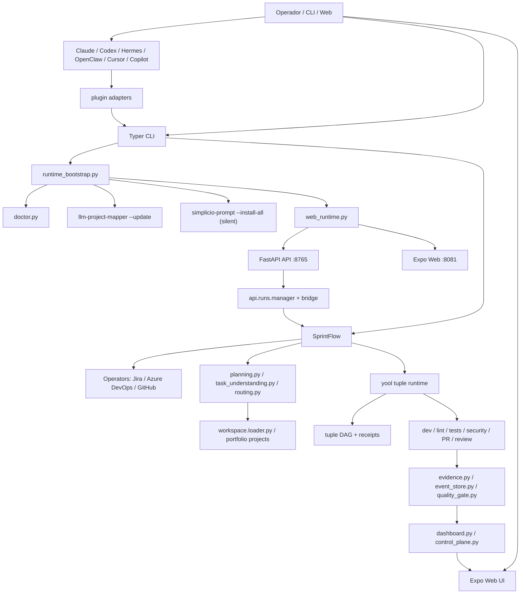
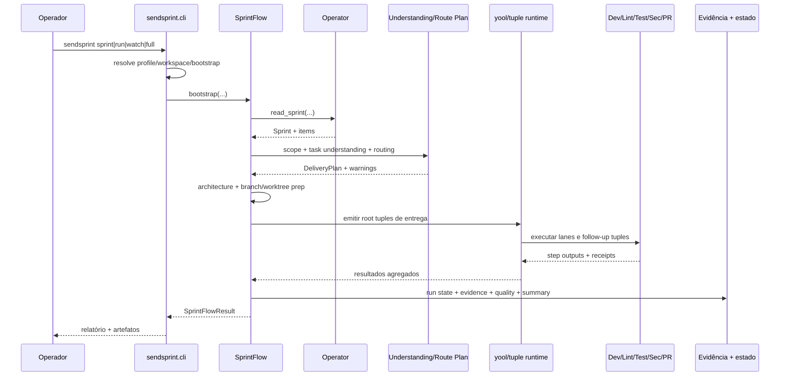

# SendSprint — mapa completo do fluxo atual

> Snapshot operacional do repositório em `C:\Users\wesley.simplicio\Pictures\m\SendSprint` em `2026-05-20`.

## 1. O que o SendSprint é hoje

O SendSprint hoje é um **control plane local** para execução autônoma de trabalho de sprint e também um **motor genérico de ações**. O núcleo ainda é o fluxo de entrega de código:

1. ler sprint/iteração;
2. mapear arquitetura e contexto;
3. planejar entrega por repo/tarefa;
4. preparar runtime/worktree;
5. executar build, lint, testes e segurança;
6. fazer rework quando necessário;
7. gerar evidências;
8. publicar commit/PR quando a política permite;
9. expor tudo em API local + dashboard web;
10. sustentar loop contínuo com `watch` / `full`.

Ao mesmo tempo, o repositório já evoluiu para um segundo eixo:

- catálogo de ações genéricas;
- adapters para código e marketing;
- modo OSS com dedupe/monitoramento;
- runtime yool/tuple/receipts;
- memória operacional, qualidade e readiness.

## 2. Stack real em uso

### Backend principal

- **Python 3.11+**
- **Typer** para CLI
- **Pydantic v2** para contratos e modelos
- **httpx** para integrações HTTP
- **FastAPI + uvicorn** para API local
- **keyring** para segredos
- **PyYAML** para `workspace.yaml`
- **pytest / ruff / mypy** para validação

### Frontend local

- **Expo Web**
- **React / React Native Web**
- **TypeScript**
- **AsyncStorage** para sessão local não sensível

### Automação e evidência

- **Playwright** para E2E/evidência visual
- **GitHub CLI (`gh`)** para PRs / issues / revisão quando necessário
- **Azure DevOps REST** e operadores próprios
- **Jira REST / MCP / Playwright fallback**

### Runtimes auxiliares

- **Node.js**: dashboard web + Playwright + toolchain web
- **Python**: runtime canônico
- **Go/Rust**: fronteiras opcionais de performance, ainda não canônicas

## 3. Entradas oficiais do sistema

### CLI

- `sendsprint sprint`
- `sendsprint run`
- `sendsprint watch`
- `sendsprint full`
- `sendsprint web`
- `sendsprint doctor`
- `sendsprint preflight`
- `sendsprint login`
- `sendsprint logout`
- `sendsprint configure-defaults`
- `sendsprint bundle-evidence`
- `sendsprint executive-report`
- `sendsprint runtime-baseline`
- `sendsprint runtime-readiness`
- `sendsprint read-jira`
- `sendsprint read-ado`
- `sendsprint read-github`
- `sendsprint init`
- `sendsprint ingest-transcript`
- `sendsprint actions ...`
- `sendsprint catalog ...`
- `sendsprint plugins list`
- `sendsprint plugins install --repo . --all`
- `sendsprint sprint dispatch|snapshot|inspect|resume`

### API local

- `python -m sendsprint.api`
- `sendsprint-api`

### Web local

- UI: `http://localhost:8081`
- API: `http://127.0.0.1:8765`

## 4. Visão geral do runtime



### Camada de plugins

O SendSprint continua sendo executado pelo CLI Python. A nova camada
`sendsprint/plugins.py` instala adapters finos para cada host:

- `.claude/skills/sendsprint/SKILL.md`
- `.codex/skills/sendsprint/SKILL.md`
- `.hermes/skills/sendsprint.md`
- `.openclaw/skills/sendsprint.md`
- `.cursor/rules/sendsprint.mdc`
- `.windsurf/rules/sendsprint.md`
- `.kiro/steering/sendsprint.md`
- `.antigravity/rules/sendsprint.md`
- `.github/copilot-instructions.md`
- `.sendsprint/plugins/manifest.json`

Esses arquivos ensinam o host a delegar para `sendsprint doctor`,
`sendsprint web`, `sendsprint sprint`, `sendsprint watch` e
`sendsprint full`, sem duplicar a esteira interna.

Perfis instalaveis atuais em `sendsprint/plugins.py`: Claude, Codex,
Hermes, OpenClaw, Cursor, Windsurf, Kiro, Antigravity e GitHub Copilot.
Os demais manifests em `skills/` continuam como referencia manual para hosts
que ainda nao tem instalador repo-local.

## 5. Fluxo operacional principal

## 5.1 Bootstrap de runtime

Todo comando principal (`run`, `sprint`, `watch`, `full`) passa por bootstrap operacional:

1. carregar perfil persistido;
2. resolver repo padrão e `workspace.yaml`;
3. rodar `run_operational_bootstrap(...)`;
4. opcionalmente:
   - verificar dependências com `doctor.py`;
   - atualizar `llm-project-mapper`;
   - atualizar `simplicio-prompt` (default ligado, execução silenciosa);
   - subir API local;
   - subir UI web;
   - abrir browser uma vez por dia;
   - cair em fallback Python se a UI web falhar.

### Módulos envolvidos

- `sendsprint/runtime_bootstrap.py`
- `sendsprint/doctor.py`
- `sendsprint/profile.py`
- `sendsprint/web_runtime.py`
- `sendsprint/cli.py`

### Comandos efetivos usados no bootstrap

- `npx -y @wesleysimplicio/llm-project-mapper@latest --update`
- `npx -y simplicio-prompt@latest --install-all` (silencioso, default ligado)
- `python -m sendsprint.api`
- `npm run dev -- --port 8081 --non-interactive`

## 5.2 Autenticação e contexto

### Jira

Fluxo:

1. ler `profile.yaml`;
2. tentar `JIRA_EMAIL` + `JIRA_API_TOKEN`;
3. se não houver, usar keyring;
4. se ainda não houver, solicitar ao operador;
5. persistir segredo no keyring;
6. persistir metadados não sensíveis no perfil.

### Azure DevOps

Fluxo atual do web:

1. usuário informa apenas:
   - URL da sprint atual;
   - PAT.
2. backend usa `azure_devops_urls.py`;
3. infere:
   - organization;
   - project;
   - team;
   - `team_path`;
   - `iteration_path`.
4. PAT vai para keyring;
5. `organization`, `project`, `team`, `default_iteration` vão para o perfil.

### GitHub

Hoje o SendSprint já usa GitHub em:

- PR creation/review;
- leitura de issues;
- integração de qualidade e monitoramento;
- comentários/evidências.

No web, o GitHub já aparece como origem de trabalho visível; intake completo via tela ainda depende do backend web crescer nessa parte.

### Módulos envolvidos

- `sendsprint/credentials.py`
- `sendsprint/profile.py`
- `sendsprint/operators/jira_operator.py`
- `sendsprint/operators/azure_devops_operator.py`
- `sendsprint/trackers/github_issues.py`
- `sendsprint/github_integration.py`
- `sendsprint/api/routes/auth.py`
- `sendsprint/azure_devops_urls.py`

## 5.3 Leitura da sprint / iteração / tracker

Leitura de origem usa a abstração de operador:

- `JiraOperator`
- `AzureDevopsOperator`
- `GitHub Issues` como tracker adicional

Regra de transporte:

1. `mcp`
2. `api`
3. `playwright`

O resultado vira um `Sprint` contendo `SprintItem[]`.

### Módulos envolvidos

- `sendsprint/operators/base.py`
- `sendsprint/operators/jira_operator.py`
- `sendsprint/operators/azure_devops_operator.py`
- `sendsprint/models/sprint.py`
- `sendsprint/api/routes/sprints.py`

## 5.4 Planejamento e escopo

Depois da leitura:

1. aplica `scope`:
   - `all`
   - `mine`
   - task keys explícitas
   - allowed statuses
2. expande histórias sem tasks em tarefas entregáveis;
3. valida ligações/hierarquia;
4. normaliza entendimento de cada item em `TaskUnderstandingReport`;
5. resolve repos do `workspace.yaml`, incluindo `portfolio.projects[].repos`;
6. cria `DeliveryPlan`;
7. decide branch, target repo, target branch, stack, confianca e politicas.

### Task understanding

`sendsprint/task_understanding.py` faz uma leitura deterministica do item de
sprint antes do roteamento. Ele combina titulo, descricao, acceptance criteria,
labels, comentarios, anexos e `parent_key` para inferir:

- projeto provavel;
- superficies (`front`, `back`, `full-stack`, `docs`, `infra`, `mobile`, `cli`);
- capabilities (`frontend-ui`, `backend-api`, `data`, `auth`, `testing`, etc.);
- repos provaveis quando ha workspace;
- necessidades de validacao;
- score de confianca e `requires_confirmation`.

Itens abaixo do limiar de confianca recebem `manual-confirmation` em
`validation_needs` e aparecem como risco no plano/preview.

### Portfolio/project routing

`sendsprint/models/workspace.py` aceita metadados de `portfolio`, `projects`
e `repos`. Cada `ProjectConfig` pode carregar capabilities, components,
owners, routing hints, branch/commit patterns e comandos de validacao. Repos
aninhados herdam `project` de `project.key` ou `project.name`; o validador
de `WorkspaceConfig` achata esses repos em `WorkspaceConfig.repos` para manter
compatibilidade com o fluxo existente.

`sendsprint/routing.py` aplica a ordem:

1. labels/regras explicitas (`repo:`, `repository:`, `project:`, `scope:`,
   `role:`, `surface:`, `capability:`, `component:`, `area:`);
2. entendimento estruturado do item;
3. perfil do repo a partir de workspace, tech fingerprint e memoria operacional;
4. fallback legado de front/back por escopo inferido;
5. fallback de baixa confianca em multi-repo.

`confidence_gate_warnings(...)` apenas avisa em autonomia `plan`, mas bloqueia
execucao com efeitos colaterais quando uma rota `low` tentaria escrever arquivos.

### Route preview

O preview usa exatamente o mesmo caminho de planejamento read-only:

- CLI: `sendsprint run ... --dry-run` e `sendsprint sprint ... --dry-run`;
- artifact CLI: `sendsprint run ... --dry-run --plan-output route-plan.json`;
- API: `POST /runs/preview`;
- control plane: `POST /api/runs/preview`.

A resposta `RoutePreviewResponse` inclui `task_understanding`,
`selected_repos`, `low_confidence_items`, warnings, side effects e resumo.
O endpoint nao cria run, nao escreve worktree, nao grava receipts e nao atualiza
watch-state.

### Módulos envolvidos

- `sendsprint/scope.py`
- `sendsprint/workspace/loader.py`
- `sendsprint/models/workspace.py`
- `sendsprint/task_understanding.py`
- `sendsprint/routing.py`
- `sendsprint/planning.py`
- `sendsprint/agents/story_task_planner.py`
- `sendsprint/post_validation.py`
- `sendsprint/issue_quality.py`

## 5.5 Arquitetura e preparo do repo

Antes da execução pesada:

1. detecta stack/tech;
2. mapeia arquitetura;
3. se necessário, gera baseline `.specs/`;
4. monta worktree/branch por item e por repo.

### Módulos envolvidos

- `sendsprint/tech/detector.py`
- `sendsprint/architecture/mapper.py`
- `sendsprint/architecture/builder.py`
- `sendsprint/scaffolder.py`
- `sendsprint/agents/worktree.py`
- `sendsprint/agentic_starter.py`

## 5.6 Orquestração de entrega

O coração do sistema está em `SprintFlow`.

### Sequência lógica



### 10 etapas base do fluxo

| Etapa | O que acontece | Módulos principais | Ferramentas/comandos comuns |
|---|---|---|---|
| 1 | Ler sprint/iteração | `operators/*`, `api/routes/sprints.py` | REST, MCP, Playwright |
| 1.25 | Expandir stories em tasks | `agents/story_task_planner.py` | regras internas |
| 1.4 | Entender tarefa + rotear repo | `task_understanding.py`, `routing.py`, `planning.py` | regras deterministicas |
| 1.5 | Importar specs para agentic-starter | `agents/sprint_importer.py` | escrita local |
| 2 | Mapear arquitetura | `architecture/mapper.py`, `builder.py` | inspeção de repo |
| 3 | Build/dev | `agents/dev.py` | npm, pnpm, yarn, pip, cargo, dotnet etc. |
| 4 | Lint | `agents/lint_runner.py` | `ruff`, `eslint`, etc. |
| 5 | Testes | `agents/test_runner.py` | `pytest`, Playwright |
| 5.1 | Inventario frontend opt-in | `agents/test_runner.py`, evidencia de run | dev server local, Playwright route smokes, screenshots |
| 6 | Segurança | `agents/security_reviewer.py` | scans e audits |
| 7 | Rework loop | `rework.py`, `quality_gate.py` | reruns até 3x |
| 8 | Commit/push | `SprintFlow`, `agents/worktree.py` | git |
| 9 | PR creation | `agents/pr_creator.py`, `pr_body_builder.py` | `gh`, REST ADO |
| 10 | Review/delivered | `agents/pr_reviewer.py`, `post_validation.py` | diff review |

## 5.7 Runtime yool / tuple / receipts

O fluxo moderno não é só sequencial; ele já usa runtime de tuples:

- `SprintFlow` emite uma root tuple por rota item/repo selecionada;
- workers consomem lanes (`dev`, `lint`, `test`, `security`, `pr`);
- cada lane pode anexar follow-up tuples, formando um DAG operacional;
- dispatcher usa cache de receipts para evitar reexecucao desnecessaria;
- receipts viram trilha imutavel e permitem `resume`;
- catalog/HAMT descreve capacidades e guardrails de cada yool.

`sendsprint sprint inspect <run_id> --cost` e `sendsprint sprint resume
<run_id|tuple_id>` sao as superficies CLI para observar/reprocessar esse DAG.

### Componentes

- `sendsprint/yool/tuples.py`
- `sendsprint/yool/bus.py`
- `sendsprint/yool/workers.py`
- `sendsprint/yool/dispatcher.py`
- `sendsprint/yool/receipts.py`
- `sendsprint/yool/runtime.py`
- `sendsprint/catalog.py`
- `sendsprint/agent_registry.py`

## 5.8 Qualidade, evidência, readiness e publicação

Após execução, o SendSprint consolida:

- `RunReport`
- quality gate
- readiness score
- diff verifier
- review pack
- evidence bundle
- rollback plan
- executive report

Para repos com `role: front`, o workspace pode declarar `frontend.base_url` e
`frontend.dev_server_command`. Esse contrato permite que o passo de testes trate
o app local como uma superficie validavel: sobe ou reaproveita o dev server,
inventaria fluxos/rotas acessiveis a partir da URL base, gera smokes Playwright
curtos, salva screenshots como evidencia e transforma falhas de rota em entrada
do mesmo rework loop limitado a 3 rodadas.

### Módulos envolvidos

- `sendsprint/models/reports.py`
- `sendsprint/evidence.py`
- `sendsprint/quality_gate.py`
- `sendsprint/readiness_score.py`
- `sendsprint/diff_verifier.py`
- `sendsprint/review_pack.py`
- `sendsprint/release_manager.py`
- `sendsprint/rollback.py`
- `sendsprint/reports/executive.py`

## 5.9 Loop contínuo: watch e full mode

### `sendsprint watch`

Executa polling periódico de Jira/ADO:

1. lê `workspace.watch`;
2. identifica itens elegíveis;
3. aplica filtros de status/tipo/assignee;
4. deduplica por revisão e estado;
5. bloqueia quando repo está sujo ou alvo não pode ser inferido;
6. dispara `SprintFlow` por item elegível;
7. grava watch-state e evidências.

### `sendsprint full`

É um atalho para:

- `watch`
- com autonomia máxima `deploy-callback`
- com dashboard local ligado
- com loop contínuo

### Módulos envolvidos

- `sendsprint/watch.py`
- `sendsprint/watch_config.py`
- `sendsprint/watch_state.py`
- `sendsprint/policy.py`
- `sendsprint/loops.py`
- `sendsprint/watchdog.py`

## 5.10 Control plane web

Hoje o painel local se divide em:

1. **Connect**
   - testa `/health`
   - lê `/auth/status`
   - se o CLI já deixou tudo autenticado, entra logado automaticamente
2. **Provider**
   - Jira
   - Azure DevOps
   - GitHub visível no fluxo
3. **Auth**
   - Jira: base URL, email, token, board opcional
   - ADO: sprint URL atual + PAT
4. **Dashboard**
   - métricas
   - lanes de validação
   - kanban por runs/tasks
   - modal com qualidade, evidências, logs e timeline
5. **Settings**
   - backend
   - provider default
   - Jira
   - ADO
   - GitHub CLI
6. **ProjectSetup**
   - modo `single` ou `portfolio`
   - repositorios, papeis, projeto, branch/commit patterns e comandos de validacao
   - salva apenas metadados nao secretos no AsyncStorage
7. **Sprints**
   - lista sprints ativas
8. **SprintDetail**
   - itens da sprint
9. **Run**
   - dispara execucao
10. **Result**
   - apresenta fechamento

### Paridade Web/CLI

O Web consome o mesmo backend local que a CLI prepara:

- auth/status: `/auth/status`, `/auth/jira`, `/auth/azuredevops`;
- sprints: `/sprints`, `/sprints/{id}`, `/sprints/import`;
- run: `/runs` + SSE `/runs/{id}/events`;
- route preview: `/runs/preview` e `/api/runs/preview`;
- control plane: `/api/runs`, qualidade e evidencias por run.

`web/src/api/types.ts` espelha `sendsprint/api/schemas.py` para
`StartRunRequest`, `RoutePreviewResponse`, `RunStatus` e contratos do control
plane. A tela `ProjectSetupScreen` modela single-project/portfolio no browser;
o backend canonico continua sendo `workspace.yaml` quando `workspace_path` e
`repo_path` sao passados para `/runs` ou `/runs/preview`.

### Componentes web principais

- `web/src/navigation.tsx`
- `web/src/store/session.tsx`
- `web/src/api/client.ts`
- `web/src/api/types.ts`
- `web/src/screens/ConnectScreen.tsx`
- `web/src/screens/ProviderScreen.tsx`
- `web/src/screens/AuthScreen.tsx`
- `web/src/screens/ProjectSetupScreen.tsx`
- `web/src/screens/DashboardScreen.tsx`
- `web/src/screens/SettingsScreen.tsx`
- `web/src/screens/SprintsScreen.tsx`
- `web/src/screens/SprintDetailScreen.tsx`
- `web/src/screens/RunScreen.tsx`
- `web/src/screens/ResultScreen.tsx`
- `web/src/components/setup/*`
- `web/src/components/*`
- `web/src/theme.ts`

## 6. Onde o SendSprint armazena cada coisa

## 6.1 Fora do repo

| O que | Local |
|---|---|
| Perfil não sensível | `~/.config/sendsprint/profile.yaml` |
| Diretório de config | `~/.config/sendsprint/` |
| Estado de “browser já aberto hoje” | `~/.config/sendsprint/dashboard-state.json` |
| Segredos Jira/ADO | OS keyring / Credential Manager / Keychain / Secret Service |
| Telemetria opcional | `~/.sendsprint/telemetry/` |

### No Windows desta máquina

- `~/.config/sendsprint/` resolve para algo no perfil do usuário, tipicamente sob `C:\Users\wesley.simplicio\.config\sendsprint\` se não houver override por `SENDSPRINT_CONFIG_DIR`.

## 6.2 Dentro do repo / workspace

| O que | Local |
|---|---|
| Estado resumível de run | `.sendsprint/runs/<run_id>.json` |
| Deduplicação do watch | `.sendsprint/runs/watch-state.json` |
| Event log durável por run | `.sendsprint/runs/<run_id>/events.ndjson` |
| Snapshot de eventos | `.sendsprint/runs/<run_id>/snapshot.json` |
| Evidência bundle v2 | `.sendsprint/evidence/<run_id>/bundle.json` |
| Memória operacional por repo | `.sendsprint/operational-memory/*.json` |
| Tuple log | `.sendsprint/tuples/<run_id>.ndjson` |
| Receipts cacheáveis | `.sendsprint/receipts/<sha-prefix>/<sha>.json` |
| Profiling runtime | `.sendsprint/profiling/` |
| Evidências “soltas” da API bridge | `evidence/<run_id>/...` |
| Evidence bundles exportados por CLI | `evidence-bundles/` ou diretório configurado |
| Screenshots Playwright do test runner | `<repo>/sendsprint-evidence/` |

## 6.3 No browser/local web

| O que | Local |
|---|---|
| Sessão não secreta do web app | AsyncStorage key `sendsprint.session.v1` |

Essa sessão guarda apenas:

- backend URL;
- provider atual;
- account;
- board id Jira;
- team path ADO;
- project setup local (`single`/`portfolio`, repositorios, papeis, projetos,
  branch/commit patterns e comandos de validacao).

Tokens nao ficam no browser; ficam no backend/keyring.

## 7. Comandos operacionais mais importantes

## 7.1 Primeira configuração

```bash
pip install -e ".[dev]"
playwright install chromium
python -m sendsprint.cli configure-defaults --repo . --workspace workspace.yaml
```

## 7.2 Autenticação

```bash
python -m sendsprint.cli login jira
python -m sendsprint.cli login azuredevops
python -m sendsprint.cli logout jira
python -m sendsprint.cli logout azuredevops
```

## 7.3 Execução

```bash
python -m sendsprint.cli sprint
python -m sendsprint.cli run jira 42 --workspace workspace.yaml --scope mine
python -m sendsprint.cli run azuredevops "Project\\Team\\Sprint 12" --workspace workspace.yaml
python -m sendsprint.cli run azuredevops "Project\\Team\\Sprint 12" --workspace workspace.yaml --dry-run --plan-output route-plan.json
python -m sendsprint.cli watch --workspace workspace.yaml
python -m sendsprint.cli full --workspace workspace.yaml
python -m sendsprint.cli web
```

## 7.4 Inspeção e segurança operacional

```bash
python -m sendsprint.cli doctor
python -m sendsprint.cli preflight jira 42 --workspace workspace.yaml
python -m sendsprint.cli runtime-baseline
python -m sendsprint.cli runtime-readiness
```

## 7.5 Evidência e relatórios

```bash
python -m sendsprint.cli bundle-evidence report.json
python -m sendsprint.cli executive-report report.json
```

## 7.6 Runtime tuple/catalog

```bash
python -m sendsprint.cli sprint dispatch --payload "{...}" agent.codex.plan
python -m sendsprint.cli sprint snapshot
python -m sendsprint.cli sprint inspect run-abc123 --cost
python -m sendsprint.cli sprint resume run-abc123
python -m sendsprint.cli catalog build
python -m sendsprint.cli catalog list
python -m sendsprint.cli catalog find pr
python -m sendsprint.cli catalog show agent.codex.plan
```

## 7.7 Web/API

```bash
python -m sendsprint.api
npm --prefix web run dev -- --port 8081 --non-interactive
npm --prefix web run typecheck
npm --prefix web run build
curl -X POST http://127.0.0.1:8765/runs/preview -H "content-type: application/json" -d "{\"provider\":\"jira\",\"sprint_id\":\"42\",\"mode\":\"all\",\"workspace_path\":\"workspace.yaml\"}"
```

## 7.8 Testes e validação

```bash
python -m pytest tests -q
python -m ruff check sendsprint web
python -m mypy sendsprint
npx playwright test
```

## 8. Arquivos Python e função de cada um

## 8.1 Núcleo de execução

- `sendsprint/__init__.py` — metadados do pacote.
- `sendsprint/cli.py` — CLI principal, bootstrap, comandos e renderização.
- `sendsprint/flow/sprint_flow.py` — orquestração principal do fluxo 10-step.
- `sendsprint/policy.py` — políticas de autonomia.
- `sendsprint/preflight.py` — checagens pré-execução.
- `sendsprint/post_validation.py` — validações pós-mutação.
- `sendsprint/planning.py` — plano de entrega.
- `sendsprint/plan_verifier.py` — gate verificável antes de implementação.
- `sendsprint/rework.py` — rework automático.
- `sendsprint/rollback.py` — plano de rollback.
- `sendsprint/release_manager.py` — recomendação de release/changelog.

## 8.2 Perfil, credenciais e bootstrap

- `sendsprint/profile.py` — perfil persistido.
- `sendsprint/credentials.py` — keyring.
- `sendsprint/doctor.py` — readiness de ambiente.
- `sendsprint/runtime_bootstrap.py` — bootstrap operacional.
- `sendsprint/web_runtime.py` — sobe API/UI e browser local.
- `sendsprint/runtime_baseline.py` — baseline Python.
- `sendsprint/runtime_readiness.py` — readiness cross-stack.
- `sendsprint/profiling_baseline.py` — baseline de profiling.
- `sendsprint/platform.py` — compatibilidade cross-platform.

## 8.3 Operadores e trackers

- `sendsprint/operators/base.py` — contrato base.
- `sendsprint/operators/jira_operator.py` — leitura Jira.
- `sendsprint/operators/azure_devops_operator.py` — leitura ADO.
- `sendsprint/trackers/github_issues.py` — boundary GitHub Issues.
- `sendsprint/github_integration.py` — integração avançada GitHub.
- `sendsprint/azure_devops_urls.py` — parser de sprint URL ADO.

## 8.4 Arquitetura, workspace e escopo

- `sendsprint/architecture/mapper.py` — inspeção/mapeamento.
- `sendsprint/architecture/builder.py` — baseline docs quando faltam.
- `sendsprint/scaffolder.py` — geração inicial `.specs/`.
- `sendsprint/workspace/loader.py` — carrega `workspace.yaml`.
- `sendsprint/models/workspace.py` — contratos do workspace.
- `sendsprint/task_understanding.py` — normalizacao deterministica de item para roteamento.
- `sendsprint/routing.py` — decisao item/repo com confianca e bloqueio de baixa confianca.
- `sendsprint/scope.py` — filtros de escopo.
- `sendsprint/tech/detector.py` — fingerprint de stack.
- `sendsprint/templates.py` — catálogo de templates/validações.

## 8.5 Agentes de execução

- `sendsprint/agents/worktree.py` — isolamento git.
- `sendsprint/agents/dev.py` — install/build por stack.
- `sendsprint/agents/lint_runner.py` — lint por stack.
- `sendsprint/agents/test_runner.py` — testes unit/E2E + screenshots.
- `sendsprint/agents/security_reviewer.py` — segurança flag-only.
- `sendsprint/agents/pr_body_builder.py` — corpo detalhado de PR.
- `sendsprint/agents/pr_creator.py` — criação de PR.
- `sendsprint/agents/pr_reviewer.py` — revisão de diff.
- `sendsprint/agents/sprint_importer.py` — specs por item.
- `sendsprint/agents/story_task_planner.py` — story → tasks.
- `sendsprint/agents/code_generator.py` — codegen LLM opt-in.
- `sendsprint/agents/deploy_trigger.py` — callback/deploy final.

## 8.6 API local

- `sendsprint/api/server.py` — app FastAPI.
- `sendsprint/api/security.py` — hardening localhost.
- `sendsprint/api/schemas.py` — contratos HTTP.
- `sendsprint/api/routes/auth.py` — auth/status.
- `sendsprint/api/routes/sprints.py` — sprints/itens/import.
- `sendsprint/api/routes/runs.py` — runs + SSE + route preview.
- `sendsprint/api/routes/control_plane.py` — runs enriquecidas + preview web.
- `sendsprint/api/routes/dashboard.py` — dashboards agregados.
- `sendsprint/api/routes/operator.py` — ações do operador.
- `sendsprint/api/runs/events.py` — broker de eventos.
- `sendsprint/api/runs/manager.py` — registry de runs.
- `sendsprint/api/runs/bridge.py` — ponte API → SprintFlow.
- `sendsprint/api/runs/agent_status.py` — snapshot amigável.
- `sendsprint/api/runs/status_answer.py` — respostas determinísticas.

## 8.7 Estado, evidência e memória

- `sendsprint/models/reports.py` — relatórios e evidências.
- `sendsprint/evidence.py` — bundles de evidência.
- `sendsprint/event_store.py` — event log durável.
- `sendsprint/run_state.py` — estado resumível/idempotente.
- `sendsprint/watch_state.py` — dedupe do watch.
- `sendsprint/operational_memory.py` — memória por repo.
- `sendsprint/failure_learning.py` — aprendizado com falhas.
- `sendsprint/quality_gate.py` — gate central.
- `sendsprint/readiness_score.py` — score de readiness.
- `sendsprint/diff_verifier.py` — valida diffs pré-publicação.
- `sendsprint/review_pack.py` — pacote de revisão humana.
- `sendsprint/historical_reporting.py` — histórico agregado.
- `sendsprint/status_renderer.py` — resposta resumida.
- `sendsprint/status_relay.py` — relay Claude/Codex/Hermes.

## 8.8 Loops, scheduling e controle

- `sendsprint/watch.py` — polling contínuo.
- `sendsprint/watch_config.py` — configuração do watcher.
- `sendsprint/watchdog.py` — stuck-agent watchdog.
- `sendsprint/scheduler.py` — scheduling paralelo.
- `sendsprint/locks.py` — locks de worktree/arquivos.
- `sendsprint/loops.py` — contratos Ralph/Codex Goal.
- `sendsprint/mission.py` — contrato Tota ↔ SendSprint.
- `sendsprint/control_plane.py` — primitives do control plane.
- `sendsprint/command_queue.py` — fila auditada de comandos.
- `sendsprint/audit.py` — trilha auditável.

## 8.9 Domínio genérico e ações

- `sendsprint/action_catalog.py` — catálogo genérico.
- `sendsprint/actions/catalog.py` — templates de playbooks.
- `sendsprint/actions/lifecycle.py` — lifecycle tipado.
- `sendsprint/actions/adapter.py` — adapter abstrato.
- `sendsprint/actions/code_adapter.py` — adapter de código.
- `sendsprint/actions/marketing_adapter.py` — adapter de marketing.
- `sendsprint/domain_quality.py` — gates não-código.
- `sendsprint/delivery_authorization.py` — autorização por perfil/projeto.
- `sendsprint/dependency_autopilot.py` — manutenção de dependências.
- `sendsprint/issue_quality.py` — qualidade de issue.
- `sendsprint/planning_publish.py` — publicar planning em GitHub Issues.
- `sendsprint/oss_mode.py` — contribuição OSS.

## 8.10 MCP, catálogo e runtime yool

- `sendsprint/mcp/server.py` — servidor MCP.
- `sendsprint/mcp/azure_devops.py` — instalação do MCP ADO.
- `sendsprint/catalog.py` — catálogo/HAMT.
- `sendsprint/agent_registry.py` — registry de capabilities.
- `sendsprint/contracts.py` — contratos do runtime.
- `sendsprint/yool/budgets.py` — budgets/guardrails.
- `sendsprint/yool/bus.py` — bus assíncrono.
- `sendsprint/yool/catalog_v2.py` — catálogo spec-shaped.
- `sendsprint/yool/contracts.py` — contratos yool.
- `sendsprint/yool/dispatcher.py` — dispatcher cache-aware.
- `sendsprint/yool/receipts.py` — receipts content-addressable.
- `sendsprint/yool/runtime.py` — utilitários de execução.
- `sendsprint/yool/tuples.py` — log append-only.
- `sendsprint/yool/workers.py` — workers/lane subscribers.

## 8.11 Performance e workers opcionais

- `sendsprint/accelerators/python_impl.py` — hot paths em Python.
- `sendsprint/accelerators/resolver.py` — escolhe backend.
- `sendsprint/accelerators/rust_bridge.py` — ponte Rust opcional.
- `sendsprint/workers/python_worker.py` — worker Python fallback.
- `sendsprint/workers/go_spec.py` — worker Go boundary/spec.
- `sendsprint/workers/resolver.py` — escolhe runtime do worker.
- `sendsprint/telemetry/recorder.py` — telemetria de duração.
- `sendsprint/telemetry/resource_telemetry.py` — fan-out e recursos.

## 8.12 Ingestão e utilitários

- `sendsprint/ingest/transcripts.py` — transcript → task candidates.
- `sendsprint/ci_repair.py` — triagem/reparo de CI.
- `sendsprint/dashboard_spec.py` — boundary do dashboard Node/Playwright.
- `sendsprint/reports/executive.py` — sumário executivo.

## 9. O que acontece, na prática, quando rodamos cada modo

## 9.1 `sendsprint sprint`

- usa defaults do perfil;
- pode virar `full` automaticamente se `auto_full_mode=true`;
- pede credenciais faltantes;
- resolve provider/sprint/repo/workspace;
- sobe bootstrap local;
- chama `SprintFlow.bootstrap(...)`;
- imprime sprint, plano, arquitetura, run report e notas.

## 9.2 `sendsprint run`

- recebe provider + id explicitamente;
- resolve workspace/repo;
- roda bootstrap;
- cria operador e escopo;
- instancia `SprintFlow`;
- executa uma vez.

## 9.3 `sendsprint watch`

- exige `workspace.watch`;
- roda bootstrap;
- faz polling;
- marca estado em `watch-state.json`;
- só reprocessa quando item muda ou `--force`.

## 9.4 `sendsprint full`

- chama `watch`;
- força autonomia `deploy-callback`;
- mantém dashboard ligado;
- fica em loop contínuo.

## 9.5 `sendsprint web`

- garante API + UI no localhost;
- abre browser uma vez por dia;
- não depende de você subir manualmente os dois processos.

## 10. Resumo direto

- **runtime canônico:** Python.
- **UI local:** Node/Expo Web.
- **segredos:** keyring, nunca no browser.
- **estado operacional:** `.sendsprint/*` dentro do repo/workspace.
- **perfil do operador:** `~/.config/sendsprint/profile.yaml`.
- **loop contínuo principal:** `watch` / `full`.
- **motor principal de entrega:** `SprintFlow`.
- **motor moderno de execução interna:** yool/tuple/receipts.
- **observabilidade local:** FastAPI + dashboard web.
- **fronteira futura de expansão:** actions/adapters + Go/Rust aceleradores.
