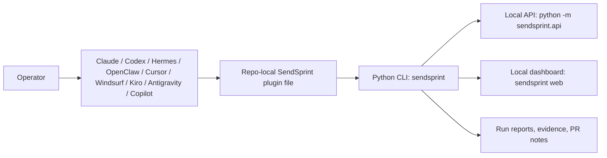

# SendSprint Plugin Adapters

SendSprint keeps Python as the canonical runtime and installs thin assistant-host adapters for the tools that should delegate work to it.

## Runtime model



The adapter is intentionally small. It teaches the host assistant how to call SendSprint and how to report evidence, but it does not reimplement sprint execution, dedupe, review, or publishing logic.

## Install commands

```bash
sendsprint plugins list
sendsprint plugins install --repo . --all
sendsprint plugins install --repo . --platform codex --platform cursor
sendsprint plugins install --repo . --all --dry-run --json
```

## Generated targets

| Platform | Target | Purpose |
| --- | --- | --- |
| Claude Code | `.claude/skills/sendsprint/SKILL.md` | Skill entrypoint for Claude/Ralph-style repair loops. |
| Codex | `AGENTS.md` | Repository instruction entrypoint for Codex and `/goal` wrapping when requested. |
| Hermes Agent | `.hermes/skills/sendsprint.md` | Hermes module contract for local SendSprint control-plane delegation. |
| OpenClaw | `.openclaw/skills/sendsprint.md` | Review/security wrapper around SendSprint reports and diffs. |
| Cursor | `.cursor/rules/sendsprint.mdc` | Always-on repo rule for Cursor workspaces. |
| Windsurf | `.windsurf/rules/sendsprint.md` | Always-on Windsurf rule that delegates sprint work to SendSprint. |
| Kiro | `.kiro/steering/sendsprint.md` | Steering file that keeps SendSprint as the canonical sprint executor. |
| Antigravity | `.antigravity/rules/sendsprint.md` | Local delivery-control-plane rule for Antigravity. |
| GitHub Copilot | `.github/copilot-instructions.md` | Repository instructions for Copilot Chat and agent flows. |

Every install also writes `.sendsprint/plugins/manifest.json` with the Python runtime, common entrypoints, and the active adapter targets.

## Operational contract

1. Run `sendsprint doctor` when dependency readiness is unknown.
2. Run `sendsprint web` when the operator wants localhost monitoring.
3. Run `sendsprint sprint` for the profile-driven default delivery path.
4. Run `sendsprint run ... --dry-run` or call `/runs/preview` when route
   confidence, selected repos, or validation gates need review before execution.
5. Run `sendsprint full --workspace workspace.yaml` for watch/full looping.
6. Inspect SendSprint artifacts before making host-native edits.
7. Report exact commands, tests, blockers, PR URLs, and next actions.

## Extension rules

- Add new host adapters in `sendsprint/plugin_templates/`.
- Register the adapter in `sendsprint/plugins.py`.
- Keep generated plugin files deterministic and safe to run repeatedly.
- Preserve existing host instructions unless the operator passes `--force`.
- Cover new adapters with focused tests in `tests/test_plugins.py`.
