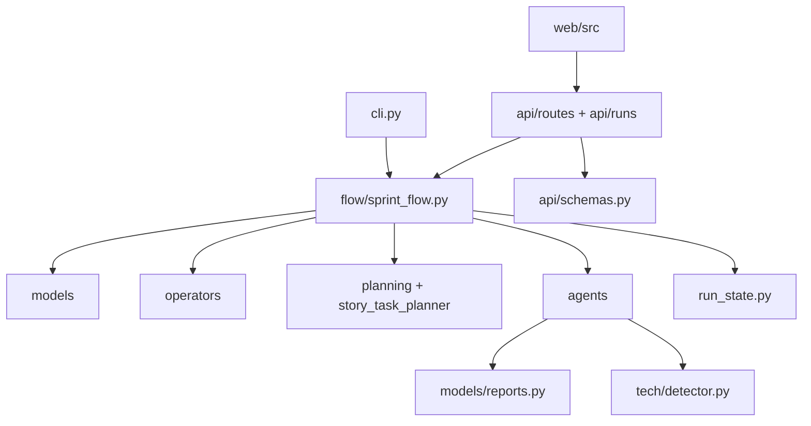

# SendSprint Dependency Map

## Python Runtime

- Python `>=3.11`.
- Package metadata and version live in `pyproject.toml` and
  `sendsprint/__init__.py`.
- Core dependencies: `typer`, `rich`, `pydantic`, `httpx`, `pyyaml`,
  `python-dotenv`, `keyring`, `anyio`, `playwright`.
- Optional providers: `anthropic`, `openai`, `google-generativeai`, `groq`,
  `ollama`.
- Optional API extras: `fastapi`, `uvicorn`.
- Dev tooling: `pytest`, `pytest-asyncio`, `pytest-cov`, `ruff`, `mypy`.

## Node/Web Runtime

- Root `package.json` provides Playwright and thin root scripts.
- `web/` contains the local dashboard application and its own `package.json`.
- `video/` contains Remotion-based marketing/demo video generation.

## External CLIs and Services

- `git` and `gh` are required for branch, worktree, push, GitHub PR, and future
  GitHub Issues automation.
- Jira and Azure DevOps are optional tracker sources through MCP/API/Playwright
  fallback.
- PyPI publishing runs through GitHub Actions release workflows.
- Playwright is used for browser/E2E evidence when a target app or dashboard is
  available.

## Internal Module Dependencies

## Dependency Rules

- Keep pure planning/report/policy modules independent from Typer/FastAPI.
- Keep tracker integrations mockable by wrapping `gh`, HTTP, and subprocess
  boundaries.
- Do not add a dependency unless it removes clear product risk or complexity.
- Prefer existing stdlib + current dependencies for roadmap issues.
